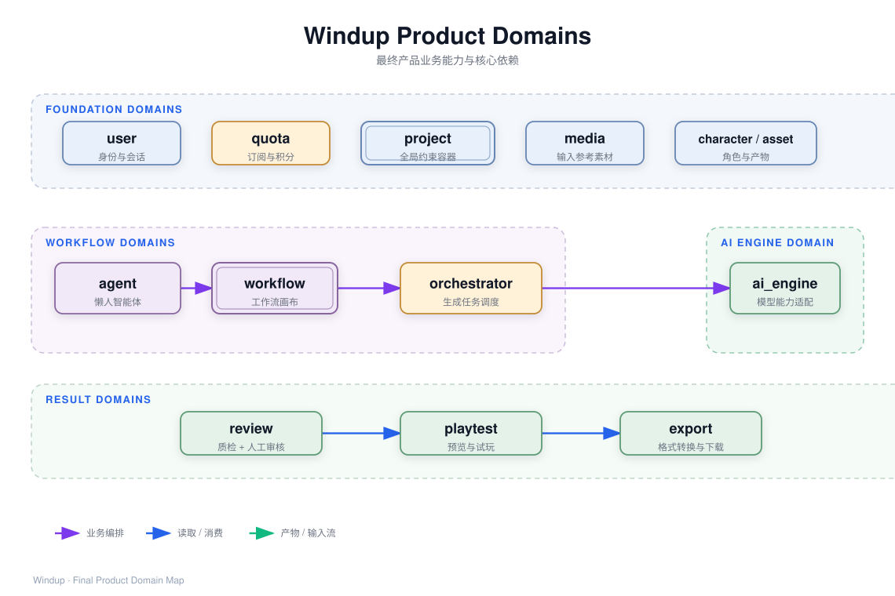

# 后端模块拆分

> 当前阶段：MVP 已实现 project / media / character / orchestrator / ai_engine。
> 按业务域拆分，每个域是一个完整的业务能力单元。

---

## 项目层级

```
backend/
├── packages/
│   ├── common/            # 共享：Response、BizException、BizCode 枚举
│   ├── framework/         # 基础设施：KodoStorage、ChatProvider、DB 配置
│   ├── ai_engine/         # 生成管线（独立包）
│   └── app/               # 业务应用
│       └── src/windup_app/
│           ├── web/api/              # FastAPI 路由
│           │   ├── generation.py     # 生成 API（前端契约）
│           │   ├── media.py          # 媒体 API
│           │   ├── project.py        # 项目 API
│           │   └── character.py      # 角色 API
│           ├── bootstrap/app.py      # 组装入口（composition root）
│           └── server/               # 业务域（按域分组）
│               ├── media/            # [foundation] 用户素材上传
│               ├── project/          # [foundation] 项目约束配置
│               ├── character/        # [foundation] 角色资产数据
│               ├── orchestrator/     # [workflow] 生成任务调度
│               ├── workflow/         # [workflow] 工作流画布（功能型卡片）
│               └── agent/            # [workflow] Agent 智能体（懒人模式）
```

> 注：`[foundation]` / `[workflow]` 标注所属业务域。
> `ai_engine` 是独立包，不属于 server/ 目录。

---

## 业务域全景



---

## 依赖方向

```
        common
          ▲
        framework
          ▲
   ┌──────┴──────┐
ai_engine     foundation
   ▲          ▲    ▲
   │     ┌────┘    │
   │   workflow    result
   │   │  │  │     │
   │   │  │  │     │
   └───┘──┘──┘─────┘
       │  │
    orchestrator
       │
    agent
```

**模块关系**：
- **workflow**（工作流画布）：卡片编排，调用 orchestrator 触动生成
- **orchestrator**（生成任务调度）：管理生成任务生命周期，调用 ai_engine
- **agent**（懒人智能体）：一句话入口，内部调用 workflow API
- **ai_engine**（生成管线）：实际 AI 生成，被 orchestrator 调用

**规则**：
- foundation → framework, common
- workflow → orchestrator, foundation, framework, common
- orchestrator → ai_engine, foundation, framework, common
- agent → workflow, framework, common
- result → foundation, framework, common
- ai_engine → framework.providers（接口）, common
- **禁止**：foundation → workflow / orchestrator / agent / result / ai_engine
- **禁止**：ai_engine → foundation / workflow / orchestrator / agent / result
- **禁止**：result → workflow / orchestrator / agent

---

## 域边界划分

### 为什么按这四个域拆分？

每个域回答一个业务问题：

| 域 | 回答的问题 | 包含什么 |
|---|---|---|
| foundation | 数据从哪来、存到哪 | 项目配置、角色数据、用户素材 |
| workflow | 何时生、为谁生、生完怎么办 | 任务调度、工作流编排 |
| pipeline | 怎么生 | 提示词 → 出图 → 抠图 → 截帧 |
| result | 生出来的东西怎么用 | 审核、预览、导出 |

### 边界职责

**foundation（基础业务域）**
- 职责：管理基础数据，被其他域消费
- 边界：各模块独立 CRUD，不包含生成、审核、导出逻辑
- 禁止：依赖 workflow / result / ai_engine

**workflow（工作流域）**
- 职责：编排调度，调用 foundation + ai_engine
- 边界：任务管理、约束加载、积分扣减、结果上传
- 禁止：依赖 result 域；直接 import ai_engine 内部实现

**pipeline（生成管线域）**
- 职责：实际生成过程（提示词 → 出图 → 抠图 → 截帧）
- 边界：AI 调用、帧处理、像素化
- 禁止：知道 project 约束、character 数据结构、图片存储位置

**result（结果域）**
- 职责：处理生成产物，提供预览和导出
- 边界：读取正式资产，独立演进
- 禁止：依赖 workflow 域；调用 ai_engine

---

## 基础业务域（Foundation）

### media — 用户素材上传

**对应表：** `windup_media`  **接口：** `MediaService`

| 方法 | 说明 |
|---|---|
| `upload(data, metadata)` | 上传文件到对象存储，返回 URL |

**文件分类 `MediaCategory`**：`reference-image` / `outfit-preview` / `action-frame` / `general`

### project — 项目约束配置

**对应表：** `windup_project`  **接口：** `ProjectService`

| 字段 | 用途 |
|---|---|
| `character_perspective` | 视角 → 生成朝向 |
| `directional_movement` | 方向数 → 生成方向变体 |
| `sprite_width` / `sprite_height` | 尺寸 → 输出帧大小 |
| `game_style` | 画风 → 提示词风格 |
| `sprite_sample_url` | 风格参考图 → 图生图模式 |

| 方法 | 说明 |
|---|---|
| `create_project(project)` | 创建项目 |
| `get_project(id)` | 按 ID 查询 |
| `list_projects(page, page_size, user_id)` | 分页查询 |
| `delete_project(id)` | 删除 |

### character — 角色资产数据

**对应表：** `windup_character`  **接口：** `CharacterService`

`character_data` JSONB 三层嵌套：outfit → action → frame

| 方法 | 说明 |
|---|---|
| `create_character(session, **fields)` | 创建角色 |
| `get_character(session, character_id)` | 按 ID 查询 |
| `list_characters(session, *, project_id, page, page_size)` | 分页查询 |
| `update_character(session, character_id, **fields)` | 更新角色 |
| `delete_character(session, character_id)` | 删除角色（含媒体清理） |

---

## 工作流域（Workflow）

### orchestrator — 生成任务调度

**对应表：** `windup_generation_task`  **接口：** `GenerationService`

管理生成任务生命周期：创建任务 → 加载项目约束 → 调 ai_engine → 上传结果 → 回写状态。

| 方法 | 说明 |
|---|---|
| `generate_character_image(input)` | 提交角色图片生成任务 |
| `generate_character_action(input)` | 提交角色动作生成任务 |
| `get_task(project_id, task_id)` | 查询任务状态与结果 |

### workflow — 工作流画布

**对应表：** `windup_workflow` / `windup_canvas_card` / `windup_generation_attempt`
**接口：** `WorkflowService` / `CardService`

功能型卡片体系：CHARACTER（角色实体）→ CANDIDATE（母版候选）/ ACTION（角色动作）/ EXPORT（资产导出）。

**卡片类型 `CardType`：** character / candidate / action / export

**WorkflowService 接口：**

| 方法 | 说明 |
|---|---|
| `create_workflow(user_id, project_id, name)` | 创建工作流（自动创建 CHARACTER 根卡片） |
| `get_workflow(workflow_id)` | 获取工作流详情（含全部 active 卡片） |
| `delete_workflow(workflow_id)` | 删除工作流（级联软删除） |

**CardService 接口：**

| 方法 | 说明 |
|---|---|
| `create_card(workflow_id, card_type, parent_card_id, ...)` | 创建子卡片（ACTION/EXPORT） |
| `confirm_card(card_id, user_input, spec_overrides?)` | 确认卡片，触发生成 |
| `regenerate_card(card_id, user_input?)` | 重新生成（新 attempt） |
| `delete_card(card_id)` | 删除卡片（级联软删除） |

**SSE 衔接：** 确认卡片返回 `GenerationAttempt`（含 `task_id`），前端订阅 Task SSE 获取进度。

### agent — Agent 智能体

**对应表：** `agent_session` / `agent_message` / `agent_tool_call`
**接口：** `AgentService`

懒人智能体：一句话搞定角色资产生成。Agent 内部调用 Workflow API 完成实际操作。

**工具定义：** create_project / create_character / generate_character_image / generate_character_action

**AgentService 接口：**

| 方法 | 说明 |
|---|---|
| `create_session(user_id, context?)` | 创建 Agent 会话 |
| `send_message(session_id, content)` | 发送用户消息 |
| `send_choice(session_id, message_id, value)` | 发送用户选择 |
| `get_messages(session_id, limit?, before?)` | 获取会话历史 |

**SSE 事件：** message / tool_call / tool_result / state_change / error

---

## 生成管线域（Pipeline）

### ai_engine — 生成管线

**接口：** `CharacterGeneratorPort`

生成管线：提示词 → 出图 → 抠图 → 截帧 → 返回产物。

| 组件 | 职责 |
|---|---|
| `strategy/` | 策略分发（VIDEO_I2V / PER_FRAME / PROC_IDLE） |
| `prompt/` | 提示词构建（walk / jump / attack） |
| `slicing/` | 帧提取（imageio/pyav） |
| `postprocess/` | 像素化、脚线对齐、sprite sheet 打包 |
| `master_prep.py` | 母版预处理 |

---

## 结果域（Result）

| 模块 | 状态 | 职责 |
|---|---|---|
| review | 🟡 前端页面体现 | 质检 + 人工审核 |
| preview | 🟡 前端页面体现 | 预览台：组装可播放数据（帧 + 帧率 + 循环） |
| export | ⬜ 待实现 | GIF / 精灵图 / 引擎格式转换 |

---

## MVP 已实现模块

| 模块 | 域 | 数据表 | API |
|---|---|---|---|
| media | foundation | windup_media | POST /media/upload |
| project | foundation | windup_project | POST/GET/DELETE /projects |
| character | foundation | windup_character | POST/GET/PATCH/DELETE /characters |
| orchestrator | workflow | windup_generation_task | POST /generation/image, POST /generation/action, GET /generation/tasks/{id} |
| workflow | workflow | windup_workflow, windup_canvas_card, windup_generation_attempt | POST/GET/DELETE /workflow, POST/PATCH/DELETE /workflow/{id}/cards, POST /cards/{id}/confirm, POST /cards/{id}/regenerate |
| agent | workflow | agent_session, agent_message, agent_tool_call | POST /agent/sessions, POST /agent/sessions/{id}/messages, POST /agent/sessions/{id}/choices, GET /agent/sessions/{id}/messages |
| ai_engine | pipeline | （无独立表） | （内部调用，不暴露 API） |
