# Windup 系统架构说明

> **状态**：初稿，待团队评审
> **版本**：v0.2
> **日期**：2026-07-25
> **范围**：Windup 最终产品架构；当前 MS2 前端 Demo 是该架构的阶段性使用者，不反向限制后端最终领域模型。

## 1. 文档定位

本文描述 Windup 的目标系统架构，而不是某个迭代的接口清单，也不是前端页面实现说明。

本文重点回答：

- 系统由哪些业务能力组成；
- 后端业务域如何拆分；
- 前端、后端、AI 服务、对象存储和基础设施如何协作；
- 最终工作流能力如何从当前 Demo 演进；
- 哪些边界和依赖必须长期保持。

当前前端文档 `docs/frontend-architecture.md` 描述的是 **MS2 阶段的前端 FSD 架构**。其中 `WorkflowRun` 是前端用于组织页面推进状态的 Entity，不要求后端建立同名领域模块。前端 Demo 可以直接调用后端的项目、角色、生成、审核、资产和导出接口。

---

## 2. 产品概述

Windup 是一个 AI 驱动的 2D 角色与动作资产生成平台。用户可以：

1. 登录并订阅积分套餐；
2. 创建项目，设置游戏视角、像素尺寸、方向等全局约束；
3. 上传项目级或生成节点级参考素材；
4. 使用 AI 生成角色模板、动作和精灵图集；
5. 对生成候选进行系统质检和人工审核；
6. 在资产库中管理正式角色、动作及其他可复用素材；
7. 预览、试玩并导出到 GIF、序列帧、精灵图集或游戏引擎格式；
8. 最终通过节点工作流自由组合和复用上述能力。

### 2.1 核心价值流

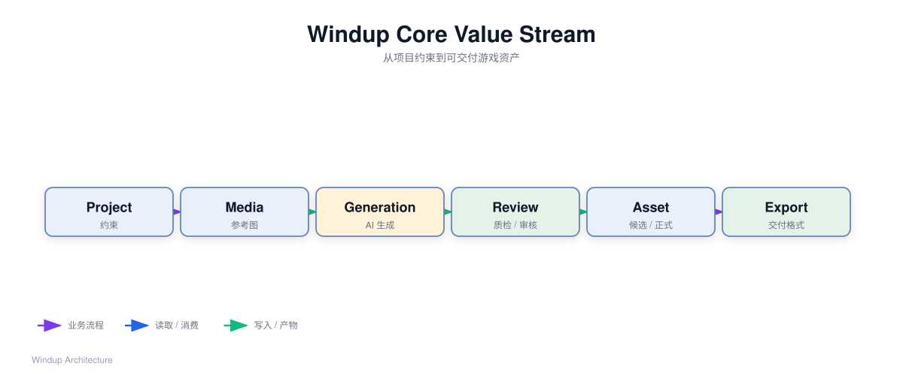

源文件：[`core-value-stream.json`](diagrams/core-value-stream.json)

```text
用户认证
  → 订阅/积分
  → 创建项目和全局约束
  → 上传参考素材
  → 生成角色/动作候选
  → 系统质检 + 人工审核
  → 确认正式资产
  → 预览试玩
  → 导出
```

### 2.2 最终产品与 MS2 的关系

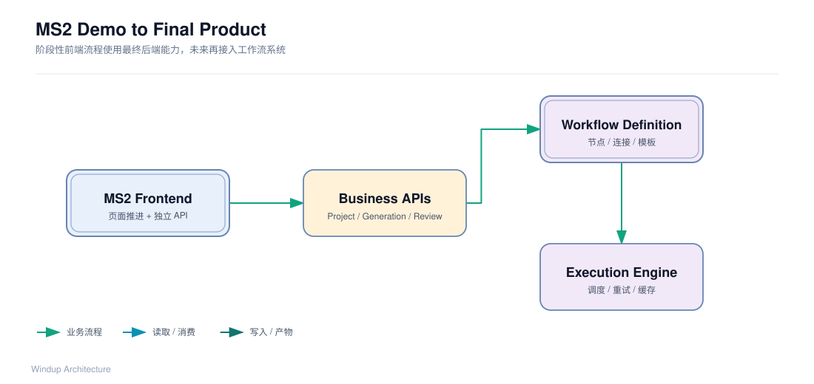

源文件：[`ms2-to-final.json`](diagrams/ms2-to-final.json)

当前 MS2 为快速展示产品价值，前端可以使用固定的页面推进逻辑：

```text
character-setup → generation → review → export
```

这只是前端交互流程，不是后端最终工作流模型。后端不需要为了适配 Demo 建立 `workflow_run` 领域模块。

最终产品的工作流能力是：

```text
Workflow Definition
  → Execution
  → Node Execution
  → Generation / Review / Export
  → Asset
```

MS2 可以直接调用独立业务接口；未来节点工作流成熟后，再由后端提供工作流定义和执行接口。

---

## 3. 系统上下文

### 3.1 外部参与者和系统

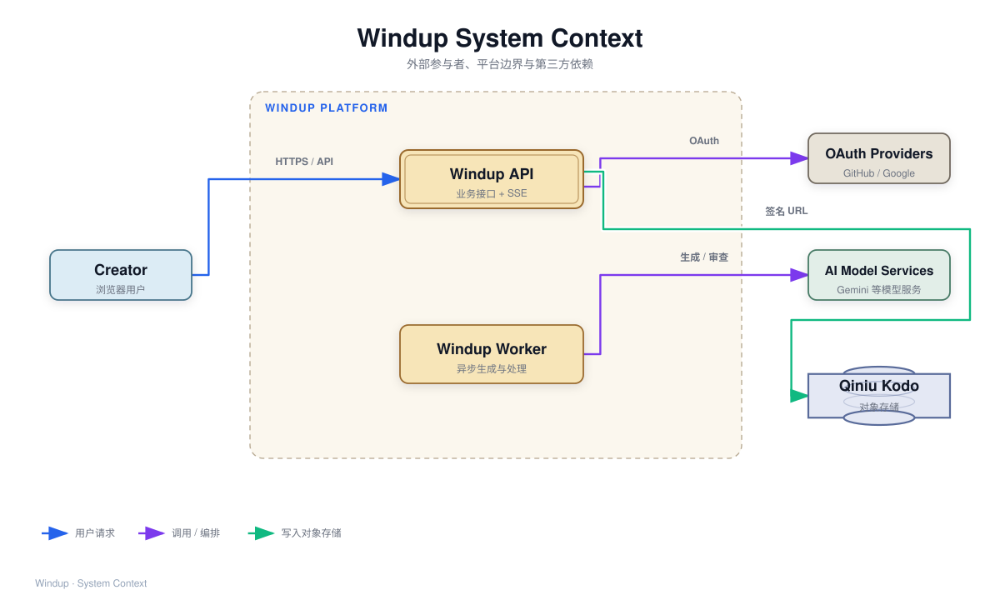

源文件：[`system-context.json`](diagrams/system-context.json)

```text
┌──────────────┐
│ 创作者/用户    │
└──────┬───────┘
       │ HTTPS / SSE
       ▼
┌──────────────────────────────────────┐
│            Windup 平台                │
│  Web API / Worker / 业务域 / AI编排    │
└────┬──────────┬──────────┬────────────┘
     │          │          │
     ▼          ▼          ▼
┌────────┐ ┌──────────┐ ┌──────────────┐
│ OAuth  │ │ AI模型服务 │ │ 七牛 Kodo    │
│ GitHub │ │ Gemini等   │ │ 对象存储      │
│ Google │ └──────────┘ └──────────────┘
└────────┘
```

Windup 内部还包含 Postgres、消息队列、API 服务和 Worker；它们在部署拓扑中展开。外部系统的可用性、限流、鉴权、费用和协议会约束 Windup 的重试、降级和任务调度设计。

### 3.2 系统边界

| 边界内 | 边界外 |
|---|---|
| 用户、项目、角色、工作流、生成任务、审核、资产、导出等业务数据 | GitHub/Google OAuth |
| 业务规则、积分扣减、候选确认、任务状态 | AI 模型供应商 |
| API、Worker、任务编排、对象引用和数据库记录 | 七牛 Kodo 对象存储 |
| 对外 API 契约和 SSE 事件 | 支付供应商（若后续引入） |

---

## 4. 总体架构分层

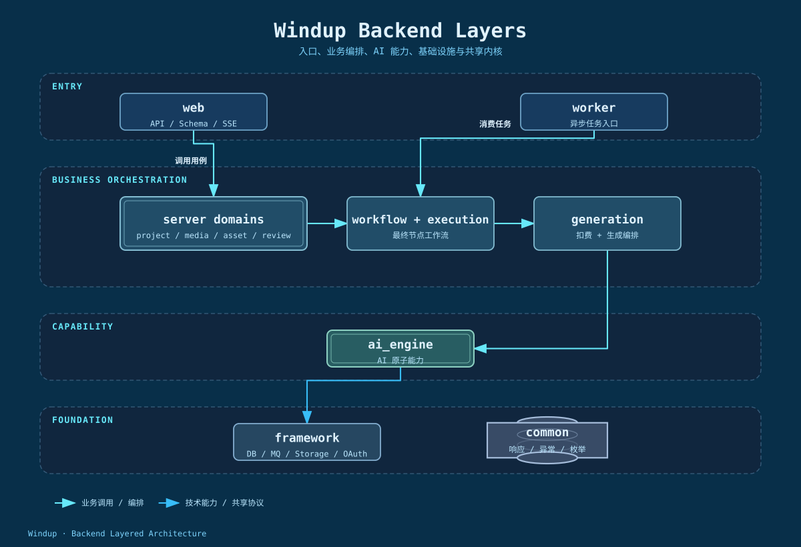

源文件：[`backend-layers.json`](diagrams/backend-layers.json)

后端采用 uv workspace monorepo，当前由四个独立包组成：

```text
windup_app
├── bootstrap       应用启动和装配
├── web             HTTP API、Schema、异常处理、SSE
├── server          业务域和应用编排
└── worker          异步任务消费入口

windup_ai_engine    AI 原子能力和模型适配
windup_framework    DB、MQ、对象存储、认证、配置、HTTP 客户端等基础设施
windup_common       统一响应、异常、枚举、共享类型和工具
```

### 4.1 依赖方向

```text
bootstrap
   ↓
web / worker
   ↓
server
   ↓
ai_engine
   ↓
framework
   ↓
common
```

当前已通过 `import-linter` 强制：

- 入口层只能向业务层依赖；
- `web` 和 `worker` 不能直接依赖 `ai_engine`；
- 同层入口相互隔离。

### 4.2 各层职责

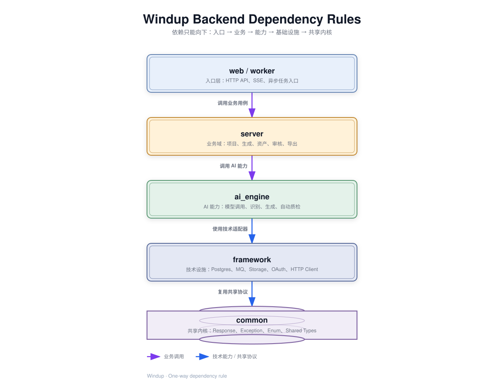

源文件：[`dependency-rules.json`](diagrams/dependency-rules.json)

| 层 | 职责 | 不负责什么 |
|---|---|---|
| `web` | 路由、请求/响应 Schema、认证入口、异常映射、SSE | 不实现业务规则、不直接调用 AI SDK |
| `worker` | 消费异步任务并调用业务用例 | 不定义 HTTP 接口 |
| `server` | 业务规则、用例编排、事务边界、领域状态 | 不直接依赖第三方 SDK 内部实现 |
| `ai_engine` | 生成、识别、审查等 AI 能力适配 | 不管理用户、项目、积分和资产业务状态 |
| `framework` | DB、MQ、Storage、OAuth、HTTP 客户端等技术能力 | 不承载 Windup 业务规则 |
| `common` | 全局共享协议和类型 | 不依赖业务域 |

---

## 5. 最终业务域划分

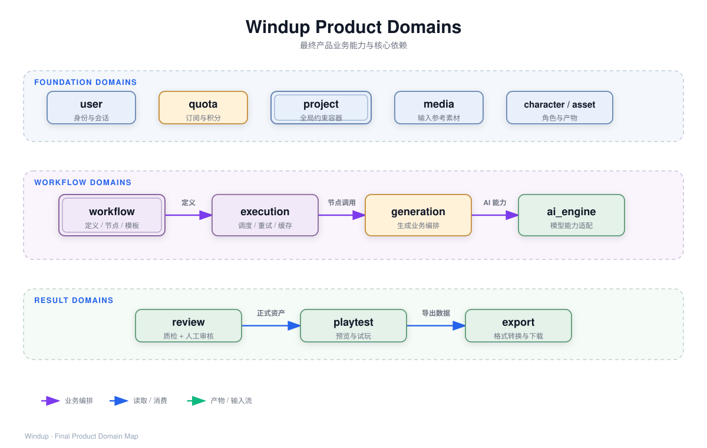

源文件：[`product-domains.json`](diagrams/product-domains.json)

```text
server/
├── user
├── quota
├── project
├── media
├── character
├── action_template
├── wearable
├── workflow
├── execution
├── generation
├── asset
├── review
├── playtest
└── export
```

### 5.1 基础业务域

#### `user`

负责用户身份、会话和第三方登录：

- 注册、登录、登出；
- 邮箱密码和验证码登录；
- GitHub、Google OAuth；
- Cookie/Session 管理；
- 修改密码；
- 当前用户信息。

`framework/auth` 只提供认证技术能力，用户身份和会话业务规则由 `server/user` 负责。

#### `quota`

负责订阅和积分：

- 套餐定义；
- 用户订阅；
- 积分发放；
- 积分余额；
- 积分扣减；
- 扣减流水和幂等。

涉及扣费的用例必须有事务边界、幂等键和并发控制，不能由多个业务域自行扣减。

#### `project`

项目是组织角色和资产的顶层业务单位，保存：

- 游戏题材；
- 美术风格；
- 视角模式（侧视、俯视、2.5D 等）；
- 像素尺寸；
- 动作方向数量；
- 项目级参考素材引用；
- 项目成员和归属关系（若后续支持协作）。

项目约束是生成请求的输入，但项目域不负责调用 AI。

### 5.2 输入和输出资产域

#### `media`：用户输入素材

`media` 管理用户上传的参考图等输入素材的业务语义：

- 上传意图和文件元数据；
- 素材归属（项目、角色或节点输入）；
- 对象存储 key；
- 上传确认；
- 引用关系；
- 删除和生命周期。

对象存储的技术能力放在 `framework/storage`，不能让每个业务域直接调用七牛 SDK。

推荐上传流程：

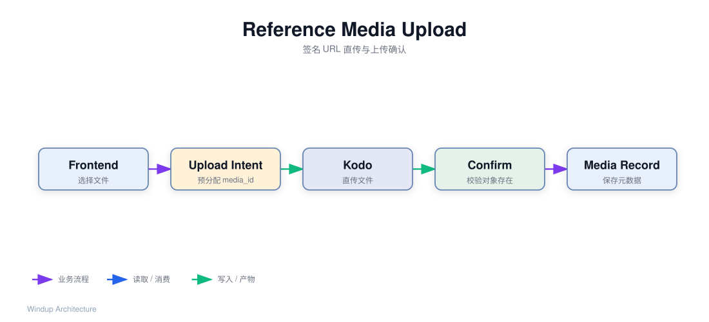

源文件：[`media-upload-flow.json`](diagrams/media-upload-flow.json)

```text
1. POST /media/upload-intents
2. 后端返回 media_id + 签名 URL
3. 前端直传 Kodo
4. POST /media/{media_id}/confirm
5. media 校验对象存在并保存业务记录
```

#### `character`

负责角色聚合及其生成内容：

- 角色；
- 角色造型/变体；
- 角色模板；
- 动作；
- 帧序列；
- 方向、帧率、循环方式；
- 候选和正式状态；
- 角色与项目的归属。

#### `action_template`

负责可跨角色、跨造型复用的动作模板：

- 待机、行走、跳跃、攻击等标准动作模板；
- 自定义动作模板；
- 模板参数和动作约束；
- 模板版本。

#### `wearable`

负责可复用的穿戴和外观资产。若产品最终确认不包含穿戴资产，可以在实现阶段将其合并到 `asset`，但必须先明确边界，不能同时出现两套所有权模型。

#### `asset`

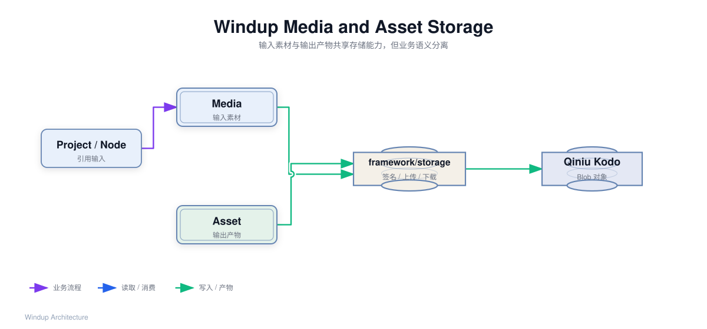

源文件：[`media-asset-storage.json`](diagrams/media-asset-storage.json)

负责系统生成的输出产物及其生命周期：

- 角色模板资产；
- 动作资产；
- 精灵图集；
- 序列帧；
- 其他生成文件；
- 候选/正式状态；
- 版本；
- 来源生成任务；
- 所属项目和角色；
- 对象存储 key 和预览地址。

资产的二进制内容存储在 Kodo，`asset` 只保存元数据和对象引用。

### 5.3 工作流和执行域

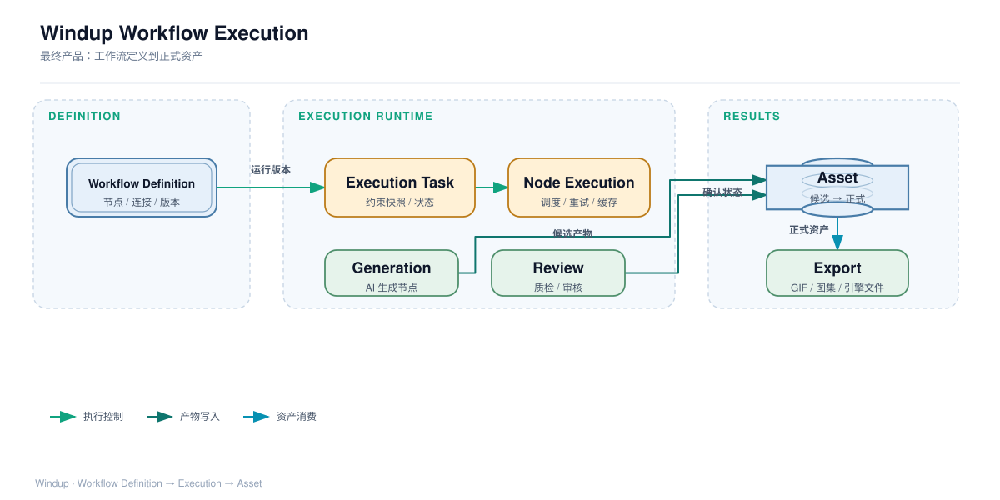

源文件：[`workflow-execution.json`](diagrams/workflow-execution.json)

#### `workflow`

负责最终产品的工作流定义，不负责具体执行：

- 工作流定义；
- 节点类型；
- 节点配置；
- 输入输出端口；
- 节点连接；
- DAG 合法性校验；
- 工作流保存、复制和复用；
- 工作流模板和版本。

节点可以代表 Prompt、角色模板生成、动作生成、审查、导出等能力。节点定义本身不等于 AI 实现。

#### `execution`

负责运行工作流：

- 创建执行任务；
- 固化工作流版本和项目约束快照；
- 拓扑排序和节点调度；
- 节点执行状态；
- 异步任务投递；
- 重试、取消和失败恢复；
- 中间结果缓存；
- 进度事件。

`execution` 是最终产品的动态执行能力。当前 MS2 可以暂不实现它，前端直接调用各独立业务能力。

#### `generation`

负责生成类业务用例：

- 角色模板生成；
- 动作生成；
- 精灵图集生成；
- 参考图和生成参数组装；
- 项目约束快照；
- 积分预估和扣减；
- 创建异步生成任务；
- 调用 `ai_engine`；
- 生成候选资产并交给 `asset` 登记。

`generation` 是业务编排层，`ai_engine` 是能力层，二者不能混合。

### 5.4 结果处理域

#### `review`

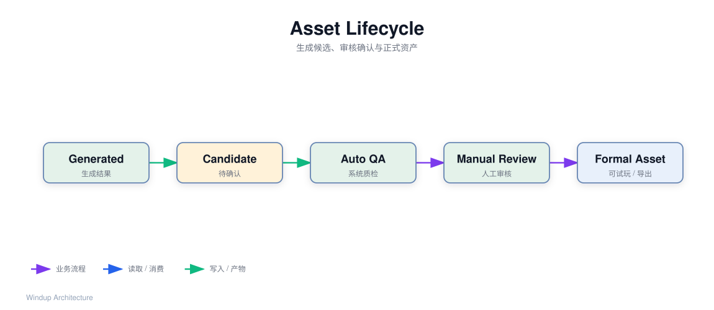

源文件：[`asset-lifecycle.json`](diagrams/asset-lifecycle.json)

负责生成结果的审查编排，并明确区分：

- 系统自动质检；
- 单帧审查；
- 逐帧审查；
- 人工审核；
- 退回修复；
- 审核记录和结论。

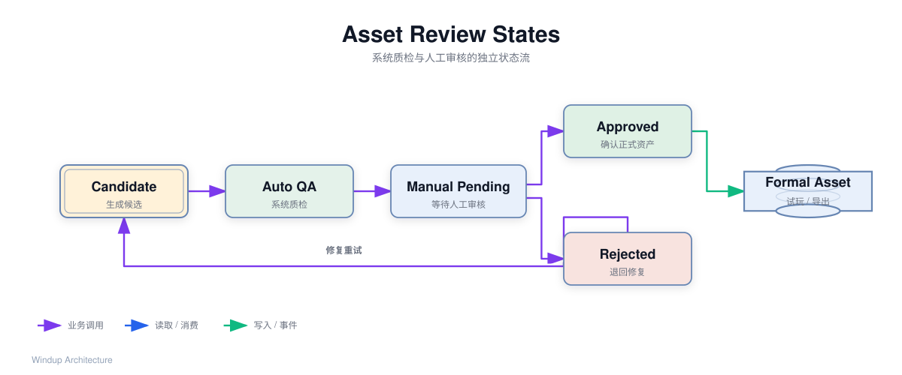

源文件：[`review-state.json`](diagrams/review-state.json)

系统质检通过不等于人工审核通过。候选资产必须经过明确的确认流程，才能成为正式资产。

#### `playtest`

负责向预览台提供已确认资产的试玩数据：

- 可播放动作；
- 帧序列；
- 帧率；
- 循环方式；
- 方向；
- 预览资源地址。

它可以从 `character`/`asset` 读取数据，不负责修改资产生成规则。

#### `export`

负责将正式资产转换为目标格式：

- GIF；
- 序列帧；
- 精灵图集；
- Cocos、Unity 等引擎文件；
- 导出任务和下载地址。

---

## 6. 核心边界和依赖

### 6.1 输入素材和输出产物


```text
project / character / workflow node
             │ 引用
             ▼
           media ───────► framework/storage ───────► Kodo

execution / generation
             │ 登记
             ▼
           asset ───────► framework/storage ───────► Kodo
```

- `media` 是用户输入；
- `asset` 是系统输出；
- `framework/storage` 只提供上传、下载、签名 URL、删除等技术能力；
- 业务归属、状态、引用和生命周期由 `media`/`asset` 管理。

### 6.2 最终工作流依赖

```text
workflow
   │ 提供定义
   ▼
execution
   ├── generation ──► ai_engine
   ├── review     ──► ai_engine（自动质检能力）
   └── export
          │
          ▼
        asset ──► storage
```

### 6.3 重要约束

1. `web`/`worker` 不直接调用 AI SDK；
2. `generation` 是生成扣费的唯一业务入口；
3. `review`/`export` 通过 `asset` 获取正式产物，不直接读取执行中间文件；
4. 业务域不直接依赖七牛 SDK；
5. 项目约束在生成时形成快照，避免项目后续修改影响已提交任务；
6. 候选资产不能直接覆盖正式资产；
7. 系统质检和人工审核是两种不同状态；
8. 工作流定义和工作流执行分离；
9. 当前前端 Demo 的 `WorkflowRun` 不约束后端领域划分。

---

## 7. 关键数据流

本节将主要业务流程分别展开为可审查的流程图；流程图源文件均保留在 `docs/diagrams/`，便于后续调整和重新渲染。

### 7.1 当前 MS2：前端直接调用业务能力

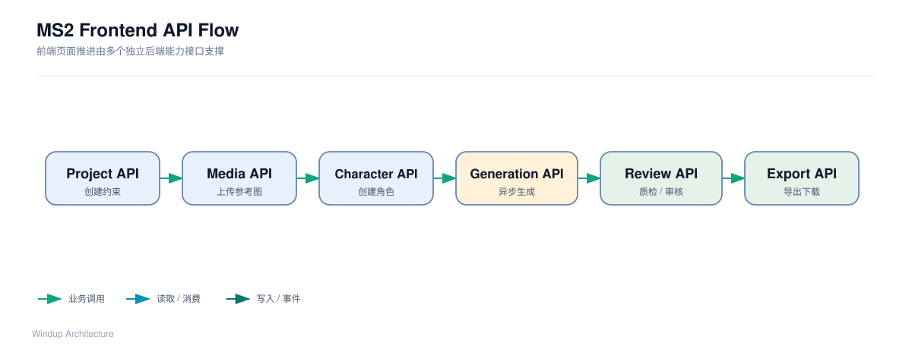

源文件：[`ms2-api-flow.json`](diagrams/ms2-api-flow.json)

```text
前端页面推进状态（前端维护）
   ├── project API：创建项目、读取约束
   ├── media API：上传参考图
   ├── character API：创建角色、保存配置
   ├── generation API：发起生成、查询任务
   ├── asset API：查询候选、确认正式资产
   ├── review API：质检和人工审核
   ├── playtest API：读取播放数据
   └── export API：发起导出、获取下载地址
```

后端不需要提供 `workflow-runs` 接口来承载这条 Demo 页面流程。

### 7.2 最终产品：工作流执行

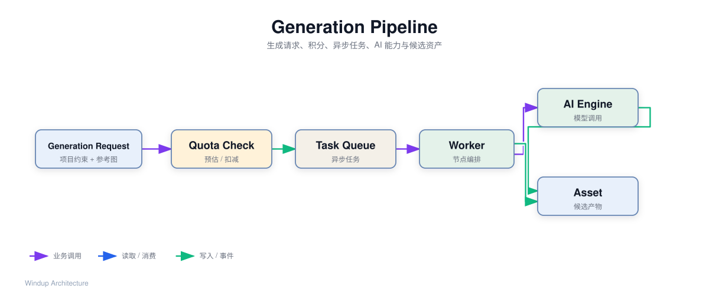

源文件：[`generation-pipeline.json`](diagrams/generation-pipeline.json)

```text
1. 用户创建或复用 WorkflowDefinition
2. execution 固化工作流版本和 Project Constraint Snapshot
3. execution 校验 DAG 并创建异步任务
4. Worker 按拓扑顺序调度节点
5. generation 节点调用 ai_engine 并扣减积分
6. 中间结果写入缓存或对象存储
7. 输出通过 asset 登记为候选资产
8. review 执行质检/人工审核
9. 用户确认后形成正式资产
10. playtest / export 消费正式资产
```

### 7.3 产物保存

```text
AI/处理节点产生二进制结果
       │
       ▼
asset.register_candidate()
       ├── framework/storage.upload()
       ├── 保存 object_key、mime、尺寸、帧信息等元数据
       └── 关联 project / character / generation
```

业务层不在各处散落 `storage.upload()` 调用，应由 `asset` 或明确的资产写入用例统一管理。

---

## 8. 前后端契约

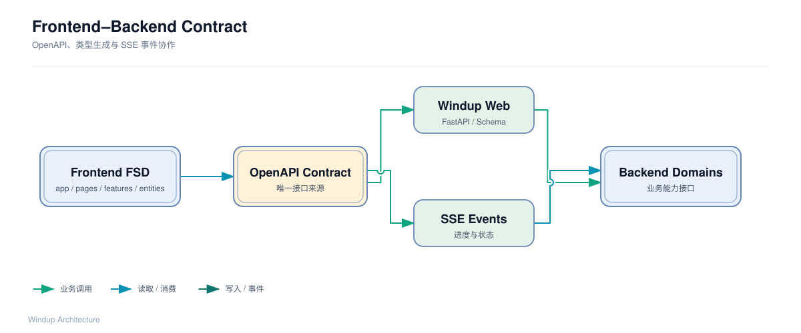

源文件：[`frontend-backend-contract.json`](diagrams/frontend-backend-contract.json)

前端 `shared/api/generated` 说明前端希望根据后端契约自动生成 TypeScript 客户端。因此：

- 后端 Pydantic Schema 是 API 契约的一部分；
- OpenAPI 是前后端接口的单一来源；
- 接口变更需要同步更新 Schema、测试和前端生成客户端；
- `Response[T]`/`ListResponse[T]`、业务码和异常映射属于跨端契约；
- SSE 事件名称、字段和状态机也必须文档化；
- 上传意图、直传、确认是三步协议；
- 资产候选/正式状态、审核状态和导出状态必须有稳定枚举。

后端应另行维护：

```text
docs/contracts/
├── api-contract.md
├── media-upload.md
├── generation-events.md
└── asset-lifecycle.md
```

这些文档是前后端共享契约，不属于后端内部实现细节。

---

## 9. 技术选型

| 领域 | 当前选择 | 说明 |
|---|---|---|
| Web | FastAPI | 类型化 API、自动 OpenAPI、异步支持 |
| 语言 | Python | 后端主语言 |
| 数据库 | PostgreSQL 16 | 事务、JSONB、复杂查询和扩展能力 |
| ORM | SQLAlchemy 2.x | 复杂领域模型和查询可控 |
| 配置 | pydantic-settings | 类型安全配置和环境变量校验 |
| 依赖管理 | uv workspace | 四包 monorepo 和锁定依赖 |
| 迁移 | Alembic | SQLAlchemy 迁移方案，待正式引入 |
| 对象存储 | 七牛 Kodo | 二进制素材和产物保存 |
| AI 能力 | `windup_ai_engine` | 通过 ports/adapter 隔离模型供应商 |
| 任务队列 | 待定 | 需要支持长任务、重试、取消和进度 |
| 实时通知 | SSE | 当前已有接入方向，事件契约待定 |
| 测试 | pytest | 单元、集成和 API 测试 |
| 架构校验 | import-linter | 强制包和层级依赖方向 |
| 代码质量 | Ruff | Lint 和格式检查 |

异步任务实现、支付供应商、缓存和搜索引擎属于后续 ADR，不在当前文档中提前锁死。

---

## 10. 部署拓扑（目标形态）

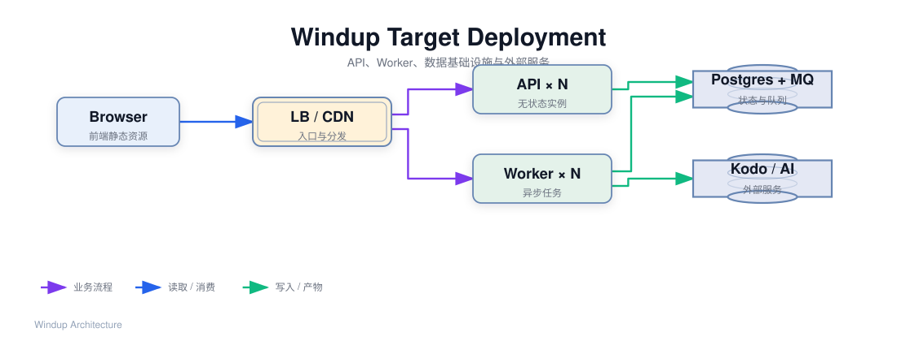

源文件：[`deployment-topology.json`](diagrams/deployment-topology.json)

部署拓扑由部署/运维方案最终确定，后端架构只定义逻辑部署单元：

```text
用户浏览器
    │
    ├── CDN ── 前端静态资源
    │
    └── HTTPS/SSE
          ▼
       Load Balancer
          ├── API 实例 × N（无状态）
          └── Worker 实例 × N（消费异步任务）
                    │
        ┌───────────┼───────────┐
        ▼           ▼           ▼
    PostgreSQL      MQ       Kodo
                                │
                         AI 模型/OAuth 外部服务
```

目标约束：

- API 实例应尽量无状态，任务和业务状态不能只保存在进程内存；
- Worker 与 API 独立扩缩容；
- 大文件不经过 API 长时间代理，优先使用签名 URL 直传；
- 数据库、MQ 和对象存储的备份策略单独定义；
- AI 服务故障不能导致用户资产和积分状态不一致。

---

## 11. 非功能性目标（待确认）

以下是架构评审时需要由产品、技术负责人和运维共同确认的目标，不是当前单方面承诺的 SLA：

| 指标 | 建议初始目标 | 影响 |
|---|---|---|
| API 可用性 | 99.5%（非生成接口） | API 副本、健康检查、发布策略 |
| 普通 API 延迟 | P95 < 500ms | 查询、索引和缓存设计 |
| 生成任务 | 异步处理，失败可重试 | MQ、Worker、幂等和状态持久化 |
| 资产持久性 | 不丢失已确认资产 | Kodo、DB 备份和删除策略 |
| RTO | 待确认 | 灾备和恢复方案 |
| RPO | 待确认 | 数据库备份频率 |

AI 生成耗时不应以普通 API 的同步响应时间衡量，而应定义：

- 任务受理时间；
- 排队等待时间；
- 生成成功率；
- 可重试失败率；
- 任务最终完成时间。

---

## 12. 架构演进路线

### 阶段一：业务能力和 Demo 支撑

实现：

```text
user / quota / project / media
character / generation / asset
review / playtest / export
```

前端自行维护 MS2 页面推进状态，后端提供稳定的独立能力接口。

### 阶段二：工作流定义

增加：

```text
workflow definition
node type
node config
edge
workflow template
workflow version
```

支持保存、复制和复用工作流，但可以先不支持复杂执行。

### 阶段三：工作流执行

增加：

```text
execution task
node execution
DAG validation
queue scheduling
retry/cancel
intermediate result cache
progress events
```

### 阶段四：平台化能力

根据产品需要增加：

- 多模型路由；
- 任务优先级；
- 并行执行；
- 结果缓存；
- 团队协作；
- 计费审计；
- 多租户；
- 版本和回滚；
- 更丰富的游戏引擎导出。

---

## 13. 当前需要记录的 ADR

| ADR | 主题 | 状态 |
|---|---|---|
| ADR-001 | 业务域按能力拆分，工作流与执行分离 | 建议采纳 |
| ADR-002 | 前端 MS2 `WorkflowRun` 不作为后端领域约束 | 建议采纳 |
| ADR-003 | 输入 `media` 与输出 `asset` 分离 | 建议采纳 |
| ADR-004 | 签名 URL 直传对象存储 | 建议采纳 |
| ADR-005 | 候选资产与正式资产分离 | 建议采纳 |
| ADR-006 | 项目约束在生成时快照 | 建议采纳 |
| ADR-007 | AI 能力与业务编排分离 | 建议采纳 |
| ADR-008 | 最终工作流执行模型 | 待评审 |
| ADR-009 | 异步任务队列和进度事件 | 待评审 |
| ADR-010 | 计费扣减、幂等和并发控制 | 待评审 |

---

## 14. 术语表

| 术语 | 定义 |
|---|---|
| Project | 组织角色和资产的顶层业务单位，包含生成约束 |
| Media | 用户上传的输入素材，如参考图 |
| Asset | 系统生成的输出产物及其元数据 |
| Workflow | 最终产品中的可保存、可复用节点工作流定义 |
| Execution | 对 Workflow 的一次后端执行过程 |
| Generation | 生成类业务用例和 AI 调用编排 |
| Candidate | 尚未确认的生成候选 |
| Formal Asset | 经确认、可被试玩和导出的正式资产 |
| Constraint Snapshot | 生成任务创建时保存的项目约束副本 |
| WorkflowRun（前端 MS2） | 前端页面组织交互流程的 Entity，不等同于后端领域模型 |
| AI Engine | 无用户业务状态的 AI 原子能力层 |
