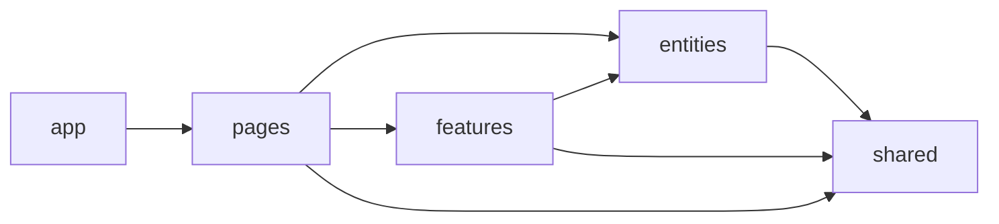
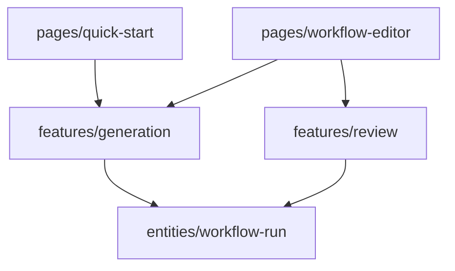
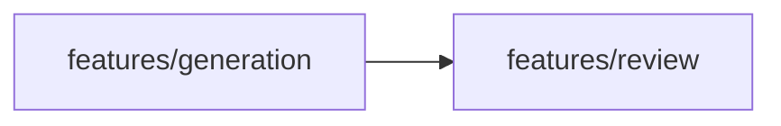
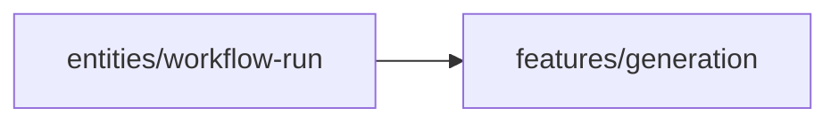
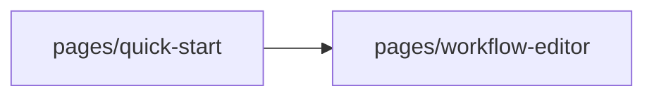
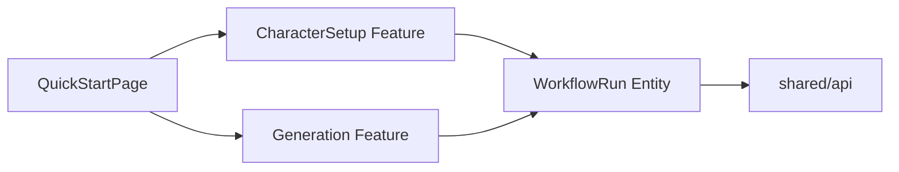
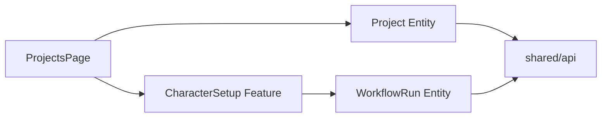
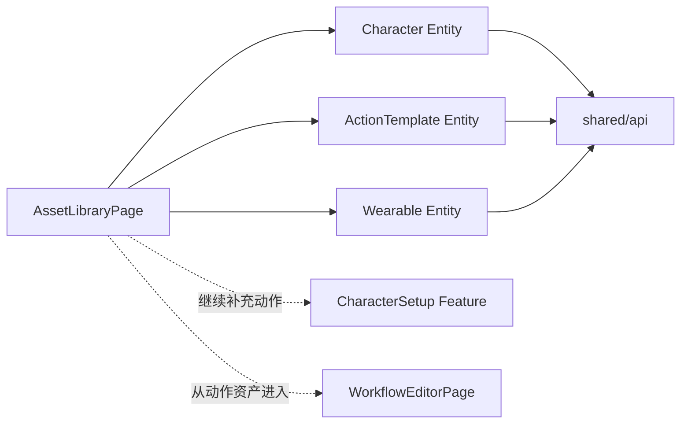
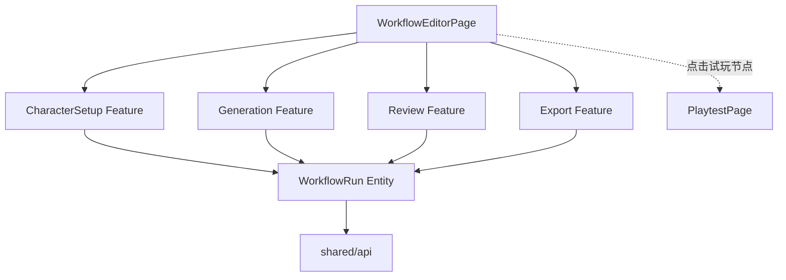
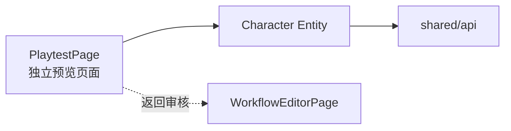

# Windup MS2 前端架构设计


## 1. 技术边界

- 工作台前端：React + Vite + TypeScript + Tailwind CSS。
- 业务后端：Python

## 2. 分层定义

| 层级 | 一句话职责 | Windup 中的内容 |
|---|---|---|
| `app` | 启动和全局配置 | Router、Provider、全局布局、错误边界 |
| `pages` | 对应完整路由页面，直接组合所需 Feature 与 Entity | 快速开始、项目页、资产库、工作流画布、试玩页 |
| `features` | 用户对业务对象执行的操作 | 角色与动作设置、生成、审核(含质检结果)、导出 |
| `entities` | 前端反复使用的业务对象 | Project、Character、ActionTemplate、Wearable、WorkflowRun |
| `shared` | 提供业务无关的通用能力 | API 传输、UI 基础件、通用工具、测试辅助 |


## 3. 依赖方向



统一规则：

1. 代码只能依赖更低层。
2. 同一层的不同 Slice 不能互相 import。
3. 每个 Slice 只通过根目录 `index.ts` 暴露公开接口。
4. 禁止绕过 `index.ts` 读取另一个 Slice 的内部文件。
5. 禁止循环依赖。

因此，合法的依赖方向：



禁止一：Feature 互相 import



禁止二：Entity 反向依赖 Feature



禁止三：Page 互相 import



### 精确 Import 权限

| 调用方 | 允许 import | 禁止 import |
|---|---|---|
| `app` | `pages`、`features`、`entities`、`shared` 的公开接口 | 任意 Slice 内部文件 |
| `pages/<name>` | `features`、`entities`、`shared` 的公开接口 | 其他 Page、任意内部文件 |
| `features/<name>` | `entities`、`shared` 的公开接口 | 其他 Feature、Pages、App |
| `entities/<name>` | `shared` 的公开接口 | 其他 Entity、Features、Pages、App |
| `shared` | `shared` 内部模块 | 所有业务层 |

## 4. WorkflowRun 的唯一归属

### 4.1 为什么是 Entity

`WorkflowRun` 是 `pages/quick-start`、`pages/workflow-editor` 及其内部的 Generation、Review 等多个模块共同使用的业务对象。它不是一个用户操作，因此不放在 Feature 内部，是独立 Entity。

前端 Entity 只描述前端需要使用的运行数据；完整数据仍由后端保存。

```ts
export interface WorkflowRun {
  id: string;
  projectId: string;
  characterId: string | null;  // 流程走到建角色那一步之前为 null，建出角色后回填
  currentStepId: string | null;
  steps: WorkflowStep[];
  status: WorkflowRunStatus;
}
```

### 4.2 Entity 内部职责

```text
entities/workflow-run/
├─ api/                          （对应后端接口待补充，需与后端同学确认）
│  ├─ create-workflow-run.ts
│  ├─ get-workflow-run.ts
│  └─ submit-workflow-step.ts
├─ model/
│  ├─ types.ts
│  ├─ queries.ts
│  └─ selectors.ts
└─ index.ts
```

- `api/`：调用 `shared/api/client`，把传输数据转换为 `WorkflowRun`。
- `model/`：类型、查询缓存键、当前步骤等纯计算。
- `index.ts`：`pages/quick-start`、`pages/workflow-editor` 和各 Feature 使用的唯一入口。
- 不包含画布、AI 对话、生成界面、审核界面。

### 4.3 两个页面如何共用

`pages/quick-start` 创建或恢复运行后得到 `runId`：

```ts
import { createWorkflowRun } from '@/entities/workflow-run';

const run = await createWorkflowRun(input);
navigate(`/workflow-editor/${run.id}`);
```

`pages/workflow-editor` 使用同一个 `runId`：

```ts
import { useWorkflowRun } from '@/entities/workflow-run';

const run = useWorkflowRun(runId);
```

两者共用的不是两份前端流程代码，而是：

```text
同一个 entities/workflow-run 公开接口
            +
同一个后端 WorkflowRun（由 runId 标识）
```

`pages/quick-start` 负责把 AI 决策转换成步骤提交；`pages/workflow-editor` 负责把用户点击转换成步骤提交。两者最终都调用 `entities/workflow-run` 的同一组命令。`pages/projects` 走"从项目开始"(选项目后复用 `character-setup`)时，同样创建/恢复 `WorkflowRun` 后跳到 `pages/workflow-editor`，不是第三条独立逻辑。

## 5. 页面、Feature 与 Entity 的协作

### QuickStartPage(`pages/quick-start`)

应用的入口/首页。



解析一句话描述后，调用 `CharacterSetup`、`Generation`，创建/恢复 `WorkflowRun`，跳转 `pages/workflow-editor/${runId}`。

### ProjectsPage(`pages/projects`)

承接"从项目开始"：选项目 → 复用 `CharacterSetup` 选/建角色、选/加动作 → 创建/恢复 `WorkflowRun`，跳转 `pages/workflow-editor`。跟 `pages/quick-start` 一样最终进同一个工作流画布，不是第三条独立逻辑。



### AssetLibraryPage(`pages/asset-library`)



`AssetLibraryPage` 直接读 `Character`、`ActionTemplate`、`Wearable` 三个 Entity 做浏览与筛选，自己管筛选状态；"继续补充动作"复用 `CharacterSetup` Feature，不重新实现；"从动作资产进入审核台"是页面跳转，指向 `pages/workflow-editor`。

### WorkflowEditorPage(`pages/workflow-editor`)

画布内部按节点切换显示哪个 Feature 的界面，各 Feature 的业务逻辑只在各自 Feature 里实现一份，不重复。



`WorkflowEditorPage` 只负责路由参数、页面外壳与画布节点切换，直接挂 `CharacterSetup`、`Generation`、`Review`、`Export` 四个 Feature，四者互不 import，各自只读写同一个 `runId` 对应的 `WorkflowRun`。试玩不挂在本页——画布上的试玩节点是页面跳转，指向独立的 `PlaytestPage`，回来时跳回本页继续审核。

### PlaytestPage(`pages/playtest`)



依据《MS2 前端业务模块拆分最终版》F2 节"在独立预览页面中试玩角色"——这一步真的是独立页面，跟其余几个不一样。`PlaytestPage` 直接读 `Character` Entity 拿已通过审核的动作，自己管按键绑定和播放状态；"返回审核"是页面跳转，回到 `WorkflowEditorPage`，不是内嵌在同一个页面里。

## 6. 目录结构

```text
src/
├─ app/                         应用启动、Router、Provider、全局配置
│  └─ layout/                   常驻 Header 与全站导航外壳
│
├─ pages/                       路由级完整页面，直接组合 Feature 与 Entity
│  ├─ quick-start/              解析一句话描述，直接用 character-setup、generation
│  ├─ workflow-editor/          手动画布，直接用 character-setup、generation、review、export
│  ├─ projects/                 项目列表详情；"从项目开始"复用 character-setup
│  ├─ asset-library/            按角色/视角/动作浏览，直接用 Character、ActionTemplate、Wearable Entity
│  └─ playtest/                 独立预览页面，浏览器内手感模拟质检
│
├─ features/                    用户对 Entity 执行的操作
│  ├─ character-setup/         创建/确认角色与母版，选择动作模板应用到角色
│  ├─ generation/              发起生成、重试、确认候选
│  ├─ review/                  人工审核、查看自动质检结果与退回修复
│  └─ export/                  选择内容、发起导出和下载
│
├─ entities/                    Windup 业务对象
│  ├─ project/                 项目数据、查询和通用展示
│  ├─ character/               角色、造型、母版、动作(Action)及候选/正式状态、帧
│  ├─ action-template/         可复用的动作模板，跨角色/跨造型复用
│  ├─ wearable/                可复用的穿戴资产，跨角色/跨造型复用
│  └─ workflow-run/            两个入口共用的运行数据和命令
│
└─ shared/                      无 Windup 业务含义的基础代码
   ├─ api/
   │  ├─ generated/            根据后端契约自动生成，禁止手改
   │  └─ client/
   │     ├─ real/              真实后端实现
   │     ├─ mock/              测试和开发使用的替代实现
   │     └─ mappers/           传输格式的通用转换与错误映射
   ├─ ui/                      Button、Modal、Input、Progress 等
   ├─ lib/                     单一职责的纯工具
   └─ testing/                 通用测试辅助工具

tests/
├─ integration/                多 Slice 组合测试
└─ e2e/                        完整用户流程测试
```

目录按真实实现增量创建，不提交空目录。Project、Character 的创建或编辑操作只有在多处复用时才提取成 Feature；仅在单个页面使用时可以保留在对应 Page 内。

## 7. 各层职责边界

### Pages

- 对应路由与完整屏幕。
- 读取路由参数，直接组合所需 Feature 与 Entity。
- `quick-start` 直接用 CharacterSetup、Generation。
- `workflow-editor` 直接用 CharacterSetup、Generation、Review、Export，画布按节点切换显示哪个 Feature 的界面。
- `asset-library` 直接用 Character、ActionTemplate、Wearable，复用 CharacterSetup 的补充动作能力。
- Page 之间不互相 import；跨页面靠 URL 跳转 + 同一个 `runId`，不是直接引用。
- 不保存跨页面业务真相，但可以持有本页独有的界面状态(如画布缩放/选中节点、当前审核帧、资产筛选条件、`PlaytestPage` 的播放状态与按键绑定)。

### Features

- 每个 Feature 表示一类用户操作。
- 可以使用 Entity 和 Shared。
- Feature 之间不互相 import。
- Generation 不实现 Review，Review 不实现 Export。

### Entities

- 保存前端所需的业务模型、查询和通用业务展示。
- Project、Character、ActionTemplate、Wearable、WorkflowRun 都是 Entity。
- Entity 不依赖 Feature。
- 后端仍是持久化事实来源。

### Shared

- 只提供业务无关的通用能力，不涉及 Project、Character、WorkflowRun 等 Windup 业务概念。
- `shared/api` 只处理传输、鉴权、真实/Mock 切换和通用错误。
- Entity 负责把传输数据转换成业务对象。
- Mock 保留用于开发、测试和故障复现，不在上线时删除。

## 8. 状态归属

| 状态 | 前端归属 | 持久化事实来源 |
|---|---|---|
| WorkflowRun、步骤、当前进度 | `entities/workflow-run` | Python 后端 |
| Project | `entities/project` | Python 后端 |
| Character、造型、动作(候选/正式状态)、帧 | `entities/character` | Python 后端 |
| ActionTemplate | `entities/action-template` | Python 后端 |
| Wearable | `entities/wearable` | Python 后端 |
| 画布缩放、拖拽、选中节点 | `pages/workflow-editor` | 前端临时状态 |
| 输入草稿 | `pages/quick-start` | 前端临时状态 |
| 当前审核帧 | `pages/workflow-editor` | 前端临时状态 |
| 资产筛选条件(角色/视角/动作) | `pages/asset-library` | 前端临时状态 |
| 播放状态、按键绑定 | `pages/playtest` | 前端临时状态 |
| CharacterSetup 交互状态 | `features/character-setup` | 角色/母版数据来自后端 |
| Generation 交互状态 | `features/generation` | 任务状态来自后端 |
| Review 交互状态 | `features/review` | 审核结论来自后端 |

不建立顶层全局业务 Store。Entity 的查询缓存按 ID 管理，同一个 `runId` 只能对应同一份 `WorkflowRun` 查询键。

## 9. 资产、审核与导出约束

- 生成候选归属于生成记录(Generation Run)。
- 候选经用户明确确认后才能成为正式资产。
- 新候选不得直接覆盖正式资产。
- 系统质检通过不等于人工审核通过。
- 逐帧审核 Canvas 与 Worker 归 `features/review`。
- PixiJS 试玩适配归 `pages/playtest`。
- 下载属于 `features/export`，不放入 `shared/lib`。
- 帧率、循环和方向来自后端契约，不在 Feature 内写死。

## 10. 骨架范围与验收

第一条骨架竖线：

```text
app 启动
→ pages/quick-start
→ entities/workflow-run 创建 WorkflowRun
→ shared/api/client 使用 mock 返回 runId
→ 跳转 pages/workflow-editor
→ pages/workflow-editor 用同一 runId 加载 WorkflowRun
```

最小 `WorkflowRun`：

```text
id
projectId
currentStepId
status
steps: [{ id, type, status }]
```

验收条件：

- `pages/quick-start` 创建后能进入 `pages/workflow-editor`。
- 两边使用同一个 `runId` 和同一个查询键。
- Page 不互相 import。
- Feature 不互相 import。
- 所有跨 Slice 引用只经过 `index.ts`。
- Mock 与真实客户端实现同一接口。
- 生产构建、类型检查、单元测试、集成测试和依赖检查通过。

## 11. 参考规范

- FSD Layers：https://feature-sliced.design/docs/reference/layers
- FSD Slices and Segments：https://feature-sliced.design/docs/reference/slices-segments
