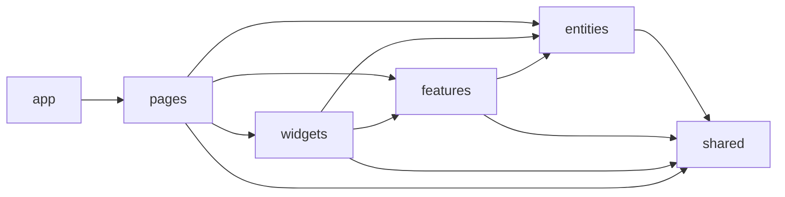
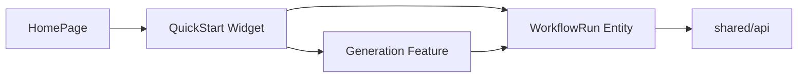
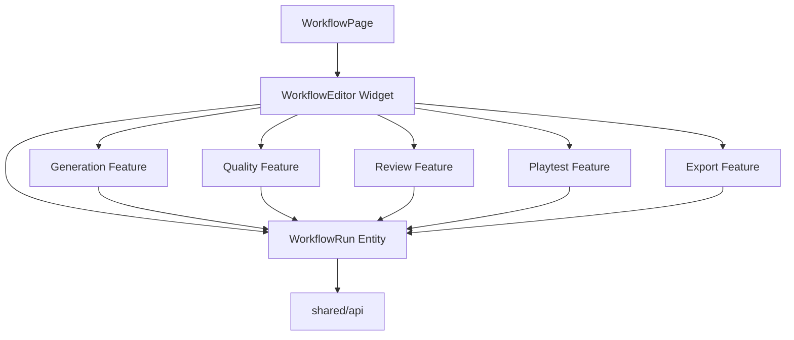

# Windup MS2 前端架构设计

> 本文定义 MS2 前端的 FSD 分层、模块职责、依赖方向，以及 Quick Start 与 Workflow Editor 共用同一份 `WorkflowRun` 的方式。

## 1. 技术边界

- 工作台前端：React + Vite + TypeScript + Tailwind CSS。
- 业务后端：Python；后端是项目、角色、资产、任务和 `WorkflowRun` 的持久化事实来源。
- 前端不复制一套业务真相，只保存渲染和交互所需的查询缓存与临时界面状态。
- 架构参考 FSD 官方分层规则，但只使用本项目确有价值的层。

## 2. 分层定义

| 层级 | 一句话职责 | Windup 中的内容 |
|---|---|---|
| `app` | 启动和全局配置 | Router、Provider、全局布局、错误边界 |
| `pages` | 对应完整路由页面 | 首页、项目页、资产库页、工作流页 |
| `widgets` | 组合多个下层模块形成完整界面区块 | Quick Start、Workflow Editor |
| `features` | 用户对业务对象执行的操作 | 生成、质检、审核、试玩、导出 |
| `entities` | 前端反复使用的业务对象 | Project、Character、Asset、WorkflowRun |
| `shared` | 不理解 Windup 业务的基础代码 | API 传输、UI 基础件、通用工具、测试辅助 |

判断方式：

- `Project`、`Character`、`WorkflowRun` 是名词，是 Entity。
- "生成动作""审核帧""导出资产"是用户操作，是 Feature。
- Quick Start 与 Workflow Editor 会组合多个 Feature 和 Entity，是 Widget。
- Button、Modal、HTTP 客户端不知道什么是 Project，属于 Shared。

## 3. 依赖方向



统一规则：

1. 代码只能依赖更低层。
2. 同一层的不同 Slice 不能互相 import。
3. 每个 Slice 只通过根目录 `index.ts` 暴露公开接口。
4. 禁止绕过 `index.ts` 读取另一个 Slice 的内部文件。
5. 禁止循环依赖。

因此：

```text
widgets/workflow-editor → features/generation → entities/workflow-run
widgets/workflow-editor → features/review     → entities/workflow-run
widgets/quick-start     → features/generation → entities/workflow-run
```

合法；但：

```text
features/generation → features/review
entities/workflow-run → features/generation
widgets/quick-start → widgets/workflow-editor
```

禁止。

### 精确 Import 权限

| 调用方 | 允许 import | 禁止 import |
|---|---|---|
| `app` | `pages`、`widgets`、`features`、`entities`、`shared` 的公开接口 | 任意 Slice 内部文件 |
| `pages/<name>` | `widgets`、`features`、`entities`、`shared` 的公开接口 | 其他 Page、任意内部文件 |
| `widgets/<name>` | `features`、`entities`、`shared` 的公开接口 | 其他 Widget、Pages、App |
| `features/<name>` | `entities`、`shared` 的公开接口 | 其他 Feature、Widgets、Pages、App |
| `entities/<name>` | `shared` 的公开接口 | 其他 Entity、Features、Widgets、Pages、App |
| `shared` | `shared` 内部模块 | 所有业务层 |

## 4. WorkflowRun 的唯一归属

### 4.1 为什么是 Entity

`WorkflowRun` 是 Quick Start、Workflow Editor、Generation、Review 等多个模块共同使用的业务对象。它不是一个页面，也不是一个用户操作，因此不放在 Widget 或 Feature。

前端 Entity 只描述前端需要使用的运行数据；完整数据仍由后端保存。

```ts
export interface WorkflowRun {
  id: string;
  projectId: string;
  currentStepId: string | null;
  steps: WorkflowStep[];
  status: WorkflowRunStatus;
}
```

### 4.2 Entity 内部职责

```text
entities/workflow-run/
├─ api/
│  ├─ create-workflow-run.ts
│  ├─ get-workflow-run.ts
│  └─ submit-workflow-step.ts
├─ model/
│  ├─ types.ts
│  ├─ queries.ts
│  └─ selectors.ts
└─ index.ts
```

- `api/`：调用 `shared/api/client`，把传输数据转换为 `WorkflowRun`。
- `model/`：类型、查询缓存键、当前步骤等纯计算。
- `index.ts`：两个 Widget 和各 Feature 使用的唯一入口。
- 不包含画布、AI 对话、生成界面、审核界面。

### 4.3 两个 Widget 如何共用

Quick Start 创建或恢复运行后得到 `runId`：

```ts
import { createWorkflowRun } from '@/entities/workflow-run';

const run = await createWorkflowRun(input);
navigate(`/workflow/${run.id}`);
```

Workflow Editor 使用同一个 `runId`：

```ts
import { useWorkflowRun } from '@/entities/workflow-run';

const run = useWorkflowRun(runId);
```

两者共用的不是两份前端流程代码，而是：

```text
同一个 entities/workflow-run 公开接口
            +
同一个后端 WorkflowRun（由 runId 标识）
```

Quick Start 负责把 AI 决策转换成步骤提交；Workflow Editor 负责把用户点击转换成步骤提交。两者最终都调用 `entities/workflow-run` 的同一组命令。

## 5. 页面、Widget、Feature 与 Entity 的协作

### HomePage



### WorkflowPage



`WorkflowPage` 只负责路由参数、页面外壳和挂载 Widget。Workflow Editor Widget 负责组合完整工作流界面，但不重新实现 Generation、Review 等 Feature。

## 6. 目录结构

```text
src/
├─ app/                         应用启动、Router、Provider、全局配置
│  └─ layout/                   常驻 Header 与全站导航外壳
│
├─ pages/                       路由级完整页面
│  ├─ home/                     挂载 Quick Start
│  ├─ projects/                 项目列表与详情
│  ├─ asset-library/            当前项目资产库
│  └─ workflow/                 挂载 Workflow Editor，传递 runId
│
├─ widgets/                     组合多个 Feature 和 Entity 的完整界面区块
│  ├─ quick-start/              AI 快捷入口，自动驱动同一份 WorkflowRun
│  └─ workflow-editor/          手动画布入口
│     ├─ canvas/                节点、连线和画布交互
│     └─ navigation/            步骤导航与当前处理位置
│
├─ features/                    用户对 Entity 执行的操作
│  ├─ generation/              发起生成、重试、确认候选
│  ├─ quality/                 查看和处理自动质检结果
│  ├─ review/                  人工审核与退回修复
│  ├─ playtest/                浏览器内手感模拟质检
│  └─ export/                  选择内容、发起导出和下载
│
├─ entities/                    Windup 业务对象
│  ├─ project/                 项目数据、查询和通用展示
│  ├─ character/               角色、造型、母版和动作关系
│  ├─ asset/                   正式资产、候选与生成记录引用
│  └─ workflow-run/            两个入口共用的运行数据和命令
│
└─ shared/                      无 Windup 业务含义的基础代码
   ├─ api/
   │  ├─ generated/            根据后端契约自动生成，禁止手改
   │  └─ client/
   │     ├─ real/              真实后端实现
   │     ├─ mock/              测试和开发使用的替代实现
   │     └─ mappers/           传输格式的通用转换与错误映射
   ├─ ui/                      Button、Modal、Input、Progress 等
   ├─ lib/                     单一职责的纯工具
   └─ testing/                 通用测试辅助工具

tests/
├─ integration/                多 Slice 组合测试
└─ e2e/                        完整用户流程测试
```

目录按真实实现增量创建，不提交空目录。Project、Character 的创建或编辑操作只有在多处复用时才提取成 Feature；仅在单个页面使用时可以保留在对应 Page 内。

## 7. 各层职责边界

### Pages

- 对应路由与完整屏幕。
- 读取路由参数，挂载 Widget。
- 可以组合下层公开接口。
- 不保存跨页面业务真相。

### Widgets

- `quick-start` 组合 AI 输入、Generation 与 WorkflowRun。
- `workflow-editor` 组合画布、Generation、Quality、Review、Playtest、Export 与 WorkflowRun。
- Widget 之间不互相 import。
- 只保存本 Widget 的界面状态，如画布缩放、选中节点、对话输入草稿。

### Features

- 每个 Feature 表示一类用户操作。
- 可以使用 Entity 和 Shared。
- Feature 之间不互相 import。
- Generation 不实现 Review，Review 不实现 Export。

### Entities

- 保存前端所需的业务模型、查询和通用业务展示。
- Project、Character、Asset、WorkflowRun 都是 Entity。
- Entity 不依赖 Feature 或 Widget。
- 后端仍是持久化事实来源。

### Shared

- 不理解 Project、Character、WorkflowRun 等 Windup 业务概念。
- `shared/api` 只处理传输、鉴权、真实/Mock 切换和通用错误。
- Entity 负责把传输数据转换成业务对象。
- Mock 保留用于开发、测试和故障复现，不在上线时删除。

## 8. 状态归属

| 状态 | 前端归属 | 持久化事实来源 |
|---|---|---|
| WorkflowRun、步骤、当前进度 | `entities/workflow-run` | Python 后端 |
| Project | `entities/project` | Python 后端 |
| Character、造型、动作关系 | `entities/character` | Python 后端 |
| 候选与正式资产引用 | `entities/asset` | Python 后端 |
| 画布缩放、拖拽、选中节点 | `widgets/workflow-editor` | 前端临时状态 |
| Quick Start 输入草稿 | `widgets/quick-start` | 前端临时状态 |
| Generation 交互状态 | `features/generation` | 任务状态来自后端 |
| Review 交互状态 | `features/review` | 审核结论来自后端 |

不建立顶层全局业务 Store。Entity 的查询缓存按 ID 管理，同一个 `runId` 只能对应同一份 `WorkflowRun` 查询键。

## 9. 资产、审核与导出约束

- 生成候选归属于 Generation Job。
- 候选经用户明确确认后才能成为正式资产。
- 新候选不得直接覆盖正式资产。
- 系统质检通过不等于人工审核通过。
- 逐帧审核 Canvas 与 Worker 归 `features/review`。
- PixiJS 试玩适配归 `features/playtest`。
- 下载属于 `features/export`，不放入 `shared/lib`。
- 帧率、循环和方向来自后端契约，不在 Feature 内写死。

## 10. 骨架范围与验收

第一条骨架竖线：

```text
app 启动
→ HomePage
→ QuickStart Widget
→ entities/workflow-run 创建 WorkflowRun
→ shared/api/client 使用 mock 返回 runId
→ 跳转 WorkflowPage
→ WorkflowEditor Widget 用同一 runId 加载 WorkflowRun
```

最小 `WorkflowRun`：

```text
id
projectId
currentStepId
status
steps: [{ id, type, status }]
```

验收条件：

- Quick Start 创建后能进入 Workflow Editor。
- 两边使用同一个 `runId` 和同一个查询键。
- Widget 不互相 import。
- Feature 不互相 import。
- 所有跨 Slice 引用只经过 `index.ts`。
- Mock 与真实客户端实现同一接口。
- 生产构建、类型检查、单元测试、集成测试和依赖检查通过。

## 11. 参考规范

- FSD Layers：https://feature-sliced.design/docs/reference/layers
- FSD Slices and Segments：https://feature-sliced.design/docs/reference/slices-segments
