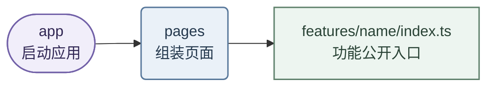
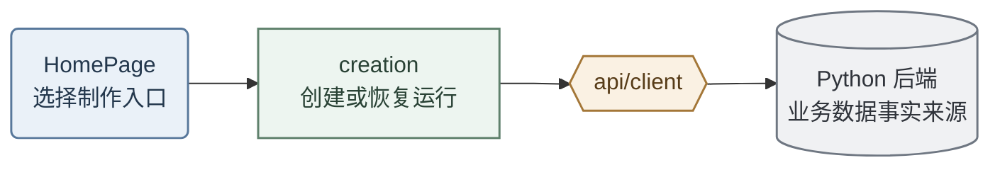
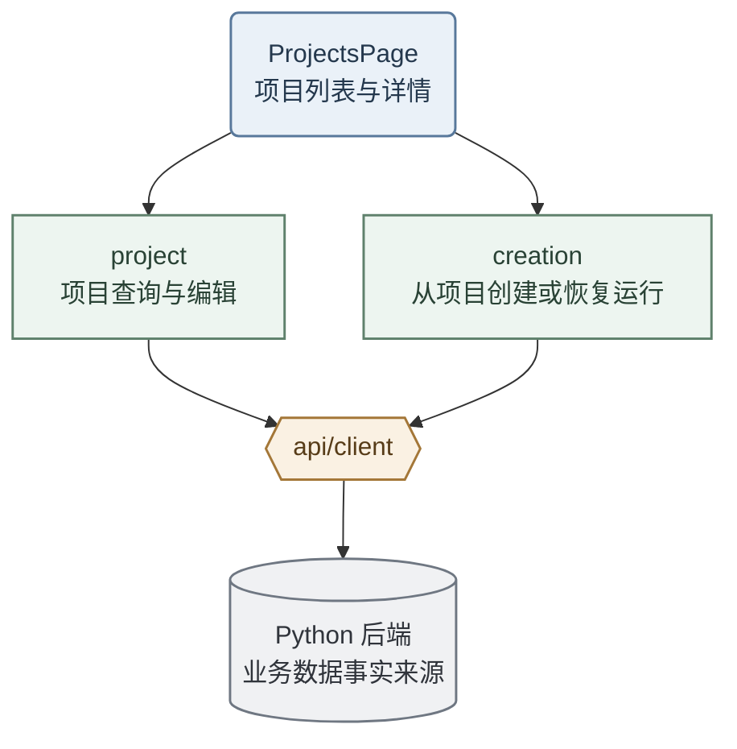
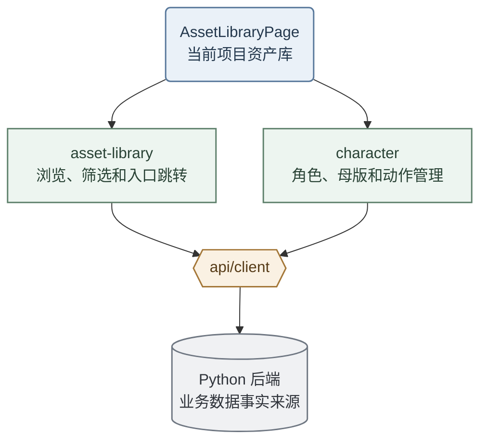
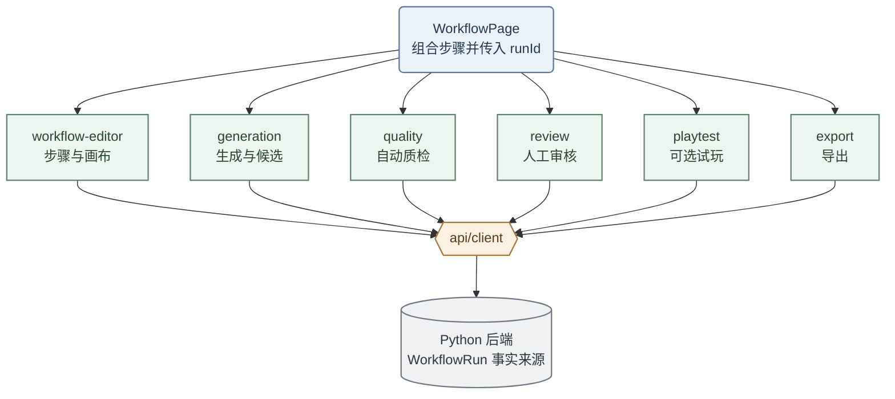

# Windup MS2 前端架构设计

> 本文定义 MS2 前端的技术边界、目录结构、依赖方向与骨架验收范围。

## 1. 技术边界

- 工作台前端：React + Vite + TypeScript + Tailwind CSS。
- 业务后端：Python，前端统一通过 API 与其通信。

## 2. 依赖方向

### 2.1 应用主干




### 2.2 页面与 Feature 协作

| 页面                 | 调用的 Feature                                                           | 页面负责                          |
| ------------------ | --------------------------------------------------------------------- | ----------------------------- |
| `HomePage`         | `creation`                                                            | 选择制作入口，创建或恢复 `WorkflowRun`    |
| `ProjectsPage`     | `project`、`creation`                                                  | 查看项目；从选中项目创建或恢复 `WorkflowRun` |
| `AssetLibraryPage` | `asset-library`、`character`                                           | 组合资产浏览与角色、母版、动作管理             |
| `WorkflowPage`     | `workflow-editor`、`generation`、`quality`、`review`、`playtest`、`export` | 组合运行画布及各步骤界面，传递 `runId` 和路由参数 |

页面只负责布局、路由和模块组装，不保存跨步骤业务真相，也不直接实现生成、审核或导出逻辑。

### 2.3 页面与 Feature 完整协作关系

箭头从 Page 指向 Feature，表示页面通过该 Feature 的 `index.ts` 调用其公开能力；箭头从 Feature 指向 `api/client`，表示业务请求统一经过 API 层。Feature 之间不互相 import。

#### HomePage



#### ProjectsPage



#### AssetLibraryPage



#### WorkflowPage



`WorkflowPage` 向各 Feature 传入同一个 `runId`。例如，`generation` 不直接调用 `review`；两者分别通过 `api/client` 使用同一份后端运行状态。

### 2.4 Feature 与基础模块协作

| Feature         | 对外能力            | 使用的业务数据          | 使用的 API 能力  |
| --------------- | --------------- | ---------------- | ----------- |
| `creation`      | 创建、恢复运行         | `WorkflowRun`、步骤 | 创建与恢复运行     |
| `project`       | 项目列表、详情和编辑      | 项目               | 项目查询与保存     |
| `character`     | 角色、母版和动作管理      | 角色、动作、帧          | 角色与动作资产读写   |
| `asset-library` | 资产浏览、筛选和入口跳转    | 角色、动作、帧          | 项目资产查询      |
| `workflow-editor` | 运行步骤、画布和当前状态    | `WorkflowRun`、步骤 | 运行状态读取与提交   |
| `generation`    | 发起、重试、查看候选和确认入库 | 生成任务、候选、正式资产     | 生成任务与候选入库   |
| `quality`       | 展示自动质检结果        | 质检结论、问题项         | 质检结果查询      |
| `review`        | 逐帧审核、修复和人工结论    | 帧、审核结论、播放规则      | 审核状态保存与修复任务 |
| `playtest`      | 动作绑定、模拟试玩和结果记录  | 动作、播放规则          | 试玩结果保存      |
| `export`        | 选择内容、发起导出和下载    | 正式资产、导出任务        | 导出任务与下载地址   |

所有 feature 都可以使用 `shared/ui` 和 `shared/lib`，但仅使用与自身职责相关的部分。Canvas、Worker、PixiJS 等专用实现保留在所属 feature 内部，不提前放进 `shared`。

### 2.5 精确 Import 权限

| 调用方 | 允许 import | 禁止 import |
|---|---|---|
| `app` | `pages`、`api/client`、`shared` | feature 内部、`api/generated` |
| `pages` | 各 feature 的 `index.ts`、`shared` | feature 内部、`api/generated`、`app` |
| `features/<name>` | `api/client`、`shared` | 其他 feature、`pages`、`app`、`api/generated` |
| `api/client` | `api/generated`、`shared/lib` | `features`、`pages`、`app`、`shared/ui` |
| `shared` | `shared` 内部文件 | 所有业务层 |

`shared/lib` 只保存无状态、无 UI、无浏览器和网络依赖的纯工具。

禁止项：

- 下层反过来 import 上层。
- 任意 feature import 另一个 feature，包括对方的 `index.ts`。
- `pages` 绕过 `features/<name>/index.ts` 进入 feature 的内部目录；`app` 直接 import feature。
- 任何循环依赖。

### 2.6 Feature 封装方式

每个 feature 是一个独立黑盒，只通过根目录的 `index.ts` 暴露稳定能力。

```text
features/generation/
├─ index.ts              唯一公开入口
├─ GenerationStep.tsx    对外页面组件
├─ model.ts              按需定义本功能内部模型
├─ adapter.ts            按需转换 API 数据
├─ components/           内部组件
├─ hooks/                内部交互逻辑
└─ state/                内部界面状态
```

`index.ts` 只导出外部真正需要的内容：

```ts
export { GenerationStep } from './GenerationStep';
export type { GenerationStepProps } from './GenerationStep';
```

`pages` 必须从公开入口使用该功能：

```ts
import { GenerationStep } from '@/features/generation';
```

禁止绕过公开入口进入内部目录；其他 feature 连该 `index.ts` 也不得引用。

`model.ts` 和 `adapter.ts` 不是固定模板，只在该 Feature 确有独立模型或数据转换时创建。模型优先靠近所属 Feature，不预建全局模型层。

ESLint 负责 import 规则的即时检查，dependency-cruiser 负责跨层依赖与循环依赖检查；CI 统一运行 `npm run verify:architecture`。

## 3. 目录结构

```text
src/
├─ app/                    应用启动、Router、Provider、全局配置
│  └─ layout/              常驻 header 与全站导航外壳，包在所有页面外层
│
├─ pages/                  路由级页面，只负责组合 feature
│  ├─ home/                制作入口
│  ├─ projects/            项目列表与详情
│  ├─ asset-library/       当前项目资产库
│  └─ workflow/            工作流外壳、画布与步骤页面
│
├─ features/               Windup 业务功能
│  ├─ creation/            制作入口、创建和恢复 WorkflowRun
│  ├─ project/             项目
│  ├─ character/           角色、造型、基准帧和动作
│  ├─ asset-library/       当前项目的角色、动作和帧资产库
│  ├─ workflow-editor/     工作流运行、步骤编排与画布展示（workflow editor）
│  │  ├─ runtime/          获取和更新本次 WorkflowRun
│  │  └─ canvas/           节点、连线和画布交互
│  ├─ generation/          生成任务、候选确认与正式入库
│  ├─ quality/             系统自动质检结果
│  ├─ review/              逐帧人工审核与修复
│  ├─ playtest/            浏览器内手感模拟质检
│  └─ export/              导出
│
├─ api/                    前端与 Python 后端的唯一通信入口
│  ├─ generated/           根据接口契约自动生成的类型，禁止手改
│  └─ client/              唯一对外接口：请求、进度更新和错误转换
│     ├─ real/             真实现：调用后端
│     └─ mock/             假实现：后端未就绪时顶替，由配置切换、上线前删
│
└─ shared/                 无业务依赖的通用零件
   ├─ ui/                  按钮、弹窗、输入框、进度条等
   ├─ lib/                 格式化、下载等通用工具
   └─ testing/             通用测试辅助工具

tests/
├─ integration/            多个模块组合测试
└─ e2e/                    完整用户流程测试
```

目录按实际实现增量创建，不提交无实现的空模块。`pages` 与 `features` 不要求一一对应：页面负责组合功能，生成、审核、试玩与导出作为工作流子页面存在。Feature 专属的模型和数据转换留在该 Feature 内；只有出现真实、稳定的跨 Feature 复用后，才提取新的公共模块。

## 4. 关键约束

### 状态归属

不建立顶层 `stores/`。工作流画布状态归属 `features/workflow-editor/canvas/`，审核状态归属 `features/review/`，试玩状态归属 `features/playtest/`；主题、全局反馈，以及常驻的 header/导航外壳（`app/layout/`）等应用级内容由 `app` 提供。

Python 后端是 `WorkflowRun` 的事实来源。`api/client/` 提供运行数据，`features/workflow-editor/runtime/` 负责加载、刷新和提交；前端仅保留界面交互所需状态。`WorkflowCanvas` 是 `WorkflowRun` 的可视化与操作界面，不作为业务状态来源。

Quick Start 与从项目开始均由 `features/creation/` 创建或恢复同一种 `WorkflowRun`，后续共用生成、审核、试玩和导出能力，不因入口不同派生两套资产状态、任务或审核逻辑。

### 候选与正式资产

生成候选归属于 Generation Job。候选经用户明确确认后才能正式入库；新候选不得直接覆盖正式资产。动作入库后的初始状态为待审核，系统质检通过不得自动标记为可导出。

### 自动质检与人工审核

`features/quality/` 展示系统质检结果，`features/review/` 保存人工审核决定。系统质检通过不等同于人工审核通过。

### 试玩与导出

`features/playtest/` 是建议执行的验收步骤，不作为导出硬门禁。动作通过人工审核后即可导出；未试玩或试玩发现问题时显示风险提示并保存结果，但不阻断导出。

### 技术适配归属

- 逐帧审核 Canvas 与 Worker 归属 `features/review/canvas/`。
- PixiJS 试玩适配归属 `features/playtest/player/`。
- 仅在多个业务模块产生真实复用后提取公共能力。

### 播放配置来源

帧率、循环和方向来自统一业务契约或后端播放配置，经 `api/client/` 提供给审核、试玩和导出，不在 Feature 内写死。各 Feature 先保留自己的播放适配；只有出现真实且稳定的重复实现后，才提取公共播放模块。

### API 边界与 Feature 模型

浏览器向 Python 后端发送的请求统一经过 `api/client/`。自动生成的接口类型放在 `api/generated/`，重新生成而不手工修改。`api/client/` 对外只暴露一套接口，其真实实现（`real/`）与桩实现（`mock/`）由环境配置切换、同一时间只启用一个，后端就绪后弃用 mock。

`api/generated/` 表示后端传输格式，仅允许 `api/client/` 直接使用。Feature 默认使用 `api/client/` 的公开结果；如果某个 Feature 需要不同的数据形状，在该 Feature 内按需增加 `model.ts` 和 `adapter.ts`，不提前建立全局模型层。分页参数、错误响应等传输对象保留在 API 层。

### 测试布局

单元测试与被测代码就近放置。根目录 `tests/` 保存跨模块 integration 测试与完整流程 e2e 测试；`shared/testing/` 仅提供通用测试工具。

## 5. 骨架范围与验收

骨架阶段跑通一条最小竖线：

```text
app 启动
→ 打开一个 page
→ page 使用一个 feature
→ feature 通过 api/client（骨架期走 mock 实现）获得数据
→ 使用 shared/ui 显示结果
```

`api/client` 对外提供最小 `WorkflowRun` 占位数据：

```text
id
currentStepId
steps: [{ id, type, status }]
```

当前步骤序号由 `currentStepId` 与步骤列表计算，其他业务字段随功能实现增量补充。

骨架验收条件：应用可启动并完成生产构建；Mock 竖线可展示；类型检查、测试与 `npm run verify:architecture` 通过。
