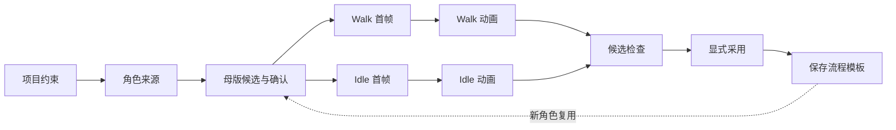

# Canvas Workbench and Workflow Reuse Proposal

## Context

当前可运行原型位于 [`huyanxius/windup-asset-lab`](https://github.com/huyanxius/windup-asset-lab)。原型已验证节点画布、生成确认、动作并发和流程模板的产品方向，但它与上游 `1024XEngineer/Windup` 不共享 Git 历史。

本文档先在个人 Fork 的独立分支中固定产品边界。待团队 Review 目录归属和接口契约后，再将实现按模块迁入上游，不直接将原型整仓拷贝进来。

## Product flow



## Interaction principles

1. 节点可自由拖动，画布视角不因新节点出现而自动跳动。
2. 未确认的下游关系显示虚线；点击目标卡片即确认连接并转为实线。
3. 普通流程不自动跳过母版、首帧和动画确认。
4. Walk 和 Idle 是并行分支，不应因一个分支运行而取消另一个分支。
5. 生成动画使用点阵波纹与模糊渐显，不使用扫描线。
6. 顶部导航在创作页转为左右悬浮 Bar；其他页面保持横向毛玻璃 Bar。

## Reusable workflow contract

工作流模板只保存项目约束和生成配置：

- view / directions / canvas size / style
- character source
- Idle / Walk briefs
- FPS
- execution mode
- template version and run provenance

模板不保存 API Key、会话、候选图片或任务输出。每次复用必须创建新任务，生成结果必须停在 `awaiting_review`，直到用户显式 promote。

## Repository integration boundary

建议在上游确认以下目录后再迁移实现：

```text
apps/asset-studio/          # 节点画布与页面
services/asset-generation/ # 生成任务、存储和发布边界
contracts/                 # 动作、视角、FPS 与模板契约
docs/                      # 架构、决策和运行指南
```

如果上游选择不同的应用框架，仍应保留候选/正式资产隔离、流程模板与 job 分离、显式 promote 以及运行溯源这四个不可退让的边界。

## Review questions

1. 节点画布应作为主产品页，还是项目资产中的独立工具？
2. 工作流模板应属于项目、用户，还是团队空间？
3. 首个上游版本是否只支持母版 + Idle + Walk？
4. 流程复用是否仅在最终入库前停止，还需要可配置的中间确认点？
