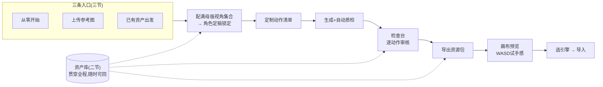
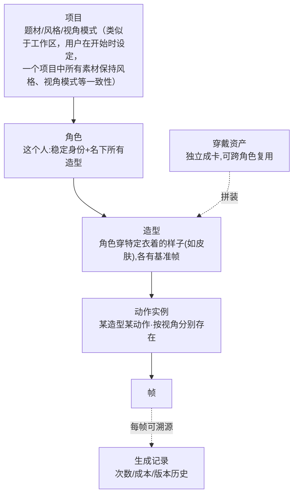
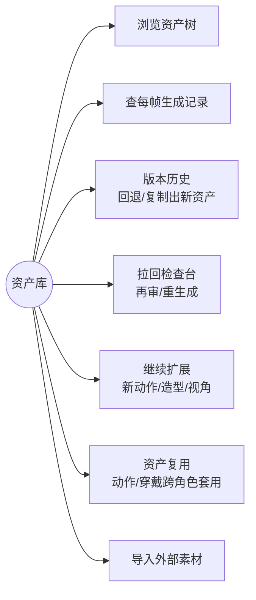
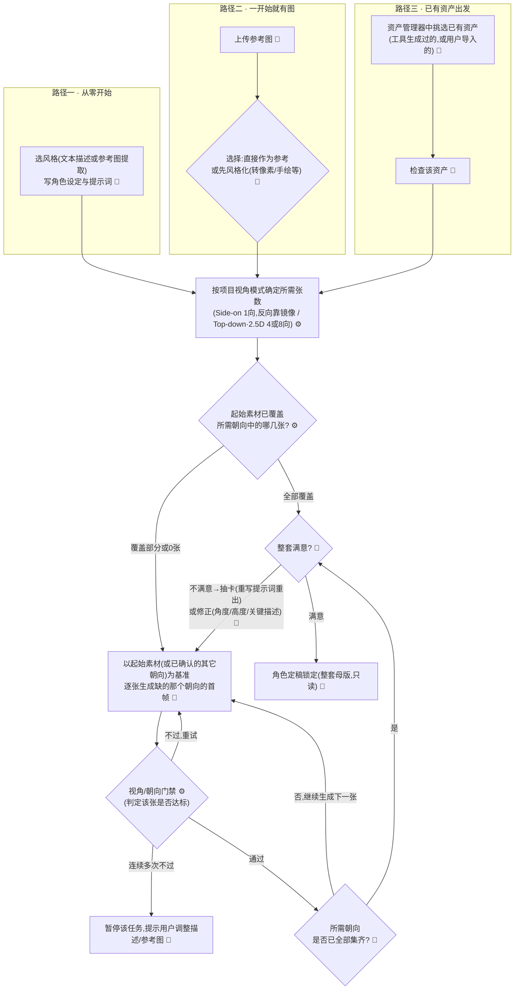
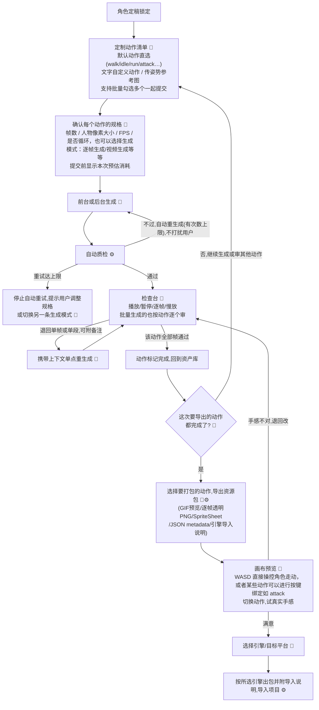

# MS1 核心流程与工作流

> 承接 #1 四节缺口（从输入到成套动作的工作流）；术语定稿回应 PR #2 行内评审；与 #16 #17 #18 数据模型对齐。

## 一、概述

Windup 主界面是一个常驻的**资产库**：项目、角色、动作在这里长期存在，可反复回来查看和扩展。进入生成有三条入口路径，之后共享同一段下游流程。

全局总览（各段细图见三、四节）：

## 二、资产库

当用户通过 Windup 生成相关资产后，资产以树状层级组织并长期保留：

相关概念：

- **项目（Project）**：题材、风格、视角/相机模式（Side-on/ Top-down / 2.5D 等，决定角色需要几张母版）。类似工作区，开始时设定，项目内所有素材保持风格与视角一致。
- **角色（Character）**：这个人本身——稳定身份（名字、脸、体型、关键标志）加上他名下的所有造型。英雄换皮肤仍是同一个英雄：无论穿什么衣服，只要是这个人，就是这个角色；角色与动作无关。
- **造型（Outfit）**：角色穿特定衣着的样子（相当于英雄的皮肤），由角色 + 穿戴资产（Wearable）组成，各自有基准帧；同一角色可有多个造型。
- **动作实例（Action Instance）**：某造型下某个动作的成套帧，按视角分别存在。
- **母版（Master）**：角色某一朝向的标准参考图，多向时构成母版视角集合，多造型后每个造型有自己的基准帧、共用角色的身份约束。

在资产库里，用户随时可以：

- **浏览资产树**：缺失的资产明确显示为"资产缺口"，如对于四向图，人物 walk 这个动作在哪个方向有所缺失，那么就会标注出来并提醒用户补全
- **生成记录**：这个角色一共生成了多少次，每一次的记录以及成本。
- **版本历史**：改过形象的旧版本保留可查，已生成的动作不受影响。
- **拉回检查台**：把已有动作重新拉回检查台再审、退回重生成。
- **基于已有资源扩展生成**：加新动作、加新造型、补新视角。
- 回退到任意历史版本，或基于某个历史版本复制出新造型 / 新角色
- **资产复用**：查看某个动作 / 某件穿戴资产可以复用到哪些角色，直接套用，不必重新定义。
- **导入外部素材**：作为资产纳入管理（也是三节路径三的入口）。

生成任务可选择在前后台生成，前台用户可以浏览生成的每个步骤，后台生成后会提醒用户

## 三、生成路径

在生成界面，Windup 从资产完整度区分出三条路径：

1. **从 0 生成**：需要确定风格、视角模式等等，通过自然语言交互生成人物形象图，若落定则开始生成初始素材。风格可由文本描述或参考图提取来定义，用户满意后落为项目级设定、锁定复用。
2. **上传参考图**：若用户已有参考图，则会基于用户提供的参考图进行生成。这一步可以进行参考图风格微调（如进行像素风格化、更改人物发色等等），同时也会判断素材完整度进行补全。
3. **已有资产出发**：若用户生成过资产，可以从资产管理器中挑选已有资产进行生成。

无论哪条路径，生成之前会先定下角色需要凑齐几张母版参考——Side-on通常一张侧视母版即可，后期通过镜像可以得到左右两个动作；Top-down或 2.5D 通常需要 4 向或 8 向。

- **Side-on** 举例：用户上传的图本身就是朝右的横版侧视图，这一向直接可用；用户给的是一张正面图，系统就以这张图为身份基准，生成一张符合横版侧视朝右要求的候选图，交用户 review。
- **Top-down / 2.5D** 举例：需要 4 向或 8 向时同理——以用户提供的第一张图为基准，逐张生成其余方向缺的那几张首帧，每张都过一次门禁和用户确认。

不管从哪条路径进来，凑齐项目所需的视角集合、用户确认满意后，结果相同——一个定稿锁定的角色（一张母版，或一整套多向母版，取决于项目的视角模式）。锁定后只读，改形象生成新版本，旧版本保留、已生成动作不受影响。

对候选图不满意时，用户始终有两条路：

1. **抽卡**：重写提示词、重选风格等参数，整张重出。
2. **修正**：在现有候选上调整角度、高度、关键描述，主要修姿态。

*相关技术实现，本文不约定。*

**路径三的分支**：用户在资产管理器里检查后认为现有资产已够用，可直接带着它进入四节的下游流程，跳过生成与门禁。

## 四、角色定稿之后：共享下游流程

- **定制动作清单**：默认动作（walk、idle、run、attack 等）直接勾选，一次可批量勾多个；不在默认清单里的动作用文字描述自定义（如"拔刀居合"），语言说不清就传一张姿势参考图。每个动作可分别设定帧数、人物像素大小、FPS、是否循环。提交前显示本次生成的预估消耗，生成后的实际消耗记入生成记录。
- **生成与质检**：生成可以指定生成模式，如逐帧图片、视频。提交后进入后台队列或在前台。生成完的帧自动过一遍质检，不合格系统自己重生成，不打扰用户，系统质检完成后进入下一步检查台供用户质检。自动重生成设次数上限，达到上限即停下提示用户调整规格或切换另一条生成模式，不做无上限重试，避免成本失控；两条生成模式互为失败兜底，具体切换策略待定。
- **检查台**：每一帧有明确状态（待审核 → 通过 / 退回）。可播放、暂停、逐帧、慢放；批量生成的多个动作也按动作逐个审，每个动作独立判定通过/退回。退回可以精确到单帧或单段，附上备注说明哪里不对；退回的部分单独重生成，已通过的帧不动。有任何一帧没通过，这个动作就不能进导出包。
- **导出**：用户自己选这次要打包哪些已完成的动作，不强制全量。导出包内容：GIF 预览、逐帧透明 PNG、Sprite Sheet 图集、JSON metadata（帧序 / FPS / 锚点 / 脚底线）、目标引擎导入说明。交付即是放进项目就能用的完整资产包。
- **画布预览**：导出后、进引擎前的最后一道验收——在预览画布里用 WASD 直接操控角色走动、切换动作，可以绑定动作如 attack 进行手感试验。不满意可以退回检查台继续改。
- **选引擎与导入**：预览满意后才选目标引擎/平台，系统按所选引擎组织包结构并附导入说明，放进项目即可播放。
