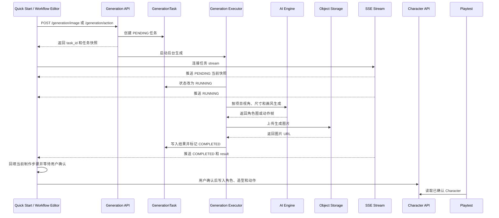

# SSE 生成全流程与接口

## 1. 当前实现状态

当前生成任务已经具备异步任务模型和 SSE 接口：

- 后端支持提交角色图、提交动作和查询任务快照。
- 后台线程执行 AI 生成、上传图片并更新任务状态。
- 后端已实现 `GET /generation/tasks/{task_id}/stream`，连接后先发送当前快照，终态后关闭。
- 前端 `GenerationApis.subscribe()` 使用带 Bearer Token 的 fetch 流；只有流接口返回 HTTP 404 时才退回任务查询。

下文描述当前已经落地的生成、查询与订阅合同。

## 2. 生成制作全流程



失败路径：Worker 捕获异常，将任务改为 `FAILED` 并写入 `error_message`；SSE 推送失败事件后关闭连接。断开 SSE 只停止接收消息，不取消后台任务。

## 3. 当前已经实现的接口

Base URL：`http://127.0.0.1:8000`

### 3.1 提交角色图生成

`POST /generation/image`

```json
{
  "user_id": 1,
  "project_id": 37,
  "reference_image_url": null,
  "prompt": "侧视像素风守夜人",
  "negative_prompt": "",
  "width": 256,
  "height": 256,
  "num_images": 4
}
```

后端创建 `character_image` 任务。输入宽高必须与项目精灵尺寸一致。

### 3.2 提交动作生成

`POST /generation/action`

```json
{
  "user_id": 1,
  "project_id": 37,
  "character_id": 25,
  "action_type": "custom",
  "custom_prompt": "举起并挥动灯笼",
  "reference_video_url": null,
  "reference_image_urls": ["https://example.com/master.png"],
  "num_frames": 32
}
```

后端创建 `character_action` 任务。生成器读取项目视角、画风和精灵尺寸，逐帧上传后返回完整帧列表。

### 3.3 查询任务快照

`GET /generation/tasks/{task_id}?project_id={project_id}`

```json
{
  "code": 200,
  "message": "success",
  "data": {
    "id": 71,
    "user_id": 1,
    "project_id": 37,
    "task_type": "character_action",
    "status": "completed",
    "input_payload": {},
    "result": {
      "type": "character_action",
      "action_type": "custom",
      "frames": [
        {
          "index": 0,
          "image_url": "https://example.com/frame-0.png",
          "duration_ms": 125
        }
      ]
    },
    "error_message": null
  }
}
```

任务状态只有：`pending`、`running`、`completed`、`failed`。当前模型没有百分比 `progress` 字段。

## 4. 已实现的 SSE 接口

### 4.1 订阅任务状态

`GET /generation/tasks/{task_id}/stream?project_id={project_id}`

响应头：

```http
Content-Type: text/event-stream
Cache-Control: no-cache
Connection: keep-alive
X-Accel-Buffering: no
```

连接建立后，服务端必须立即推送任务当前快照，不能等待下一次状态变化。任务进入终态后推送最后一条消息并关闭连接。

### 4.2 任务事件

```text
event: task_update
id: 71:2
retry: 2000
data: {"task_id":71,"project_id":37,"task_type":"character_action","status":"running","result":null,"error_message":null}

```

完成事件：

```text
event: task_update
id: 71:3
data: {"task_id":71,"project_id":37,"task_type":"character_action","status":"completed","result":{"type":"character_action","action_type":"custom","frames":[]},"error_message":null}

```

失败事件：

```text
event: task_update
id: 71:3
data: {"task_id":71,"project_id":37,"task_type":"character_action","status":"failed","result":null,"error_message":"母版下载失败"}

```

事件字段：

| 字段            | 类型        | 说明                                    |
| --------------- | ----------- | --------------------------------------- |
| `task_id`       | int         | 生成任务 ID                             |
| `project_id`    | int         | 所属项目 ID                             |
| `task_type`     | string      | `character_image` 或 `character_action` |
| `status`        | string      | 四种任务状态之一                        |
| `result`        | object/null | 仅完成时存在                            |
| `error_message` | string/null | 仅失败时存在                            |

### 4.3 心跳事件（尚未实现）

当前实现每秒检查任务快照，但没有单独心跳事件。若部署代理会关闭空闲连接，可后续增加：

```text
event: ping
data: {}

```

心跳不进入业务状态机，前端可以忽略。

## 5. 后端处理规则

1. 建立流之前校验 `project_id + task_id`，不存在返回业务码 404。
2. 建立连接后立即查询数据库并推送当前快照。
3. 只在状态、更新时间或错误变化时推送 `task_update`，不重复发送同一快照。
4. `completed` 或 `failed` 推送后关闭连接。
5. 客户端断开时释放监听资源，但不停止 GenerationTask。
6. 客户端重连时不依赖内存中的旧连接，重新读取数据库最新状态。
7. MVP 不添加虚假的百分比进度；若以后需要逐帧进度，应先扩展任务模型和事件表。

当前后台任务使用线程执行。单进程 MVP 可以使用任务通知队列唤醒 SSE；多进程部署时需要 Redis Pub/Sub、数据库通知或持久事件表，不能只依赖进程内 `asyncio.Queue`。

## 6. 前端接入规则

`GenerationApis` 的业务接口保持不变：

```ts
interface GenerationApis {
  create(input: GenerationInput): Promise<Generation>;
  get(projectId: string, taskId: string): Promise<Generation>;
  subscribe(
    projectId: string,
    taskId: string,
    onEvent: (event: GenerationEvent) => void,
  ): () => void;
}
```

`subscribe()` 使用可设置请求头的 fetch 流实现；浏览器原生 `EventSource` 不能设置
`Authorization`，不得用于受保护接口：

```ts
const subscribe = createEventStreamSubscriber({
  getAccessToken,
  recoverUnauthorized,
});
return subscribe(streamUrl, {
  eventName: "task_update",
  onEvent(data) {
    const event = parseTaskUpdate(data);
    onEvent(event);
    return event.status === "completed" || event.status === "failed";
  },
  onError,
});
```

Workflow Controller 继续消费统一的 `GenerationEvent`，不感知底层使用 SSE 还是 404 查询兜底。页面刷新后按节点保存的 taskId 恢复订阅；SSE 建连后会立即回放当前任务快照。

## 7. 模块责任边界

- `generation`：创建任务、执行生成、保存任务结果、推送 SSE。
- `workflow-controller`：把任务结果写入当前前端制作步骤。
- `character`：只在用户确认后保存最终角色和动作。
- `playtest`：只读取已确认 Character 进行预览和核验，不订阅生成任务。
- 当前不接历史记录，也不建设资产库流程。
